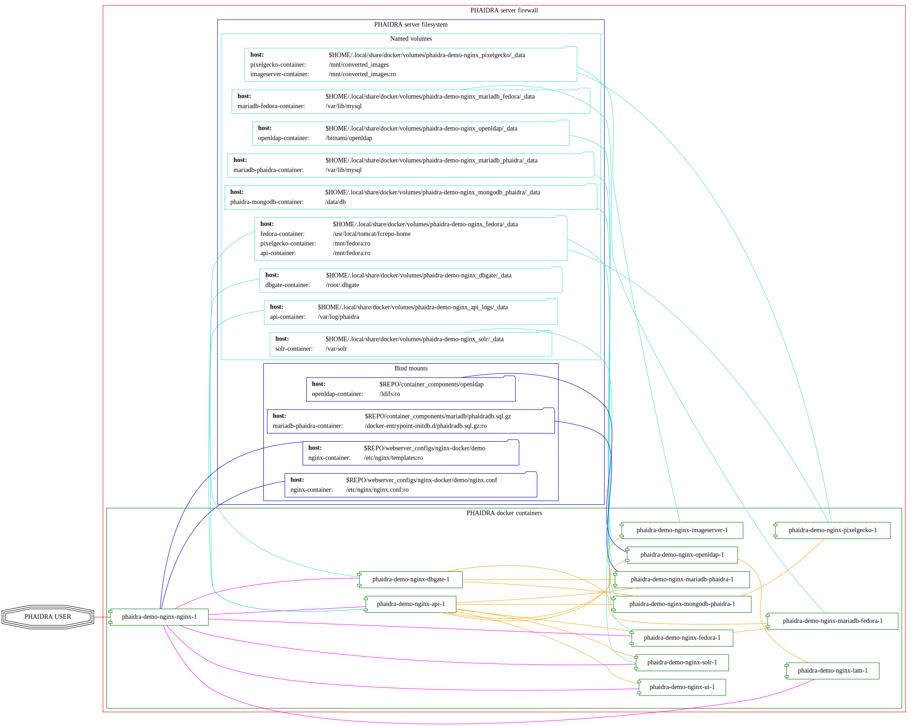
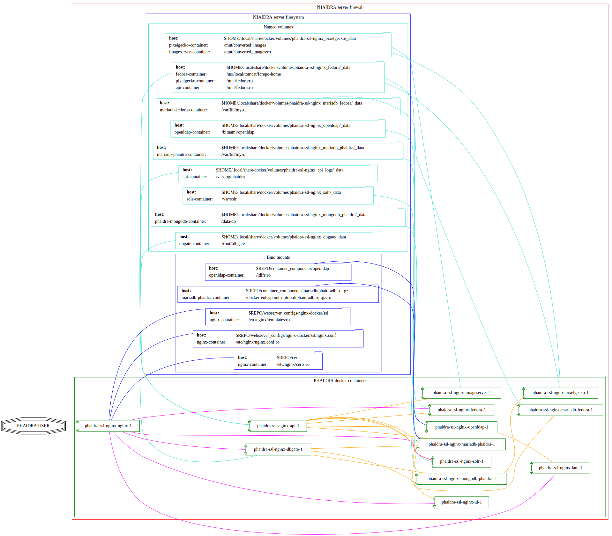
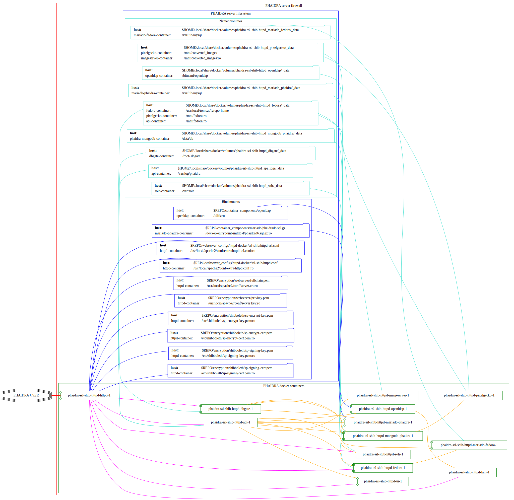
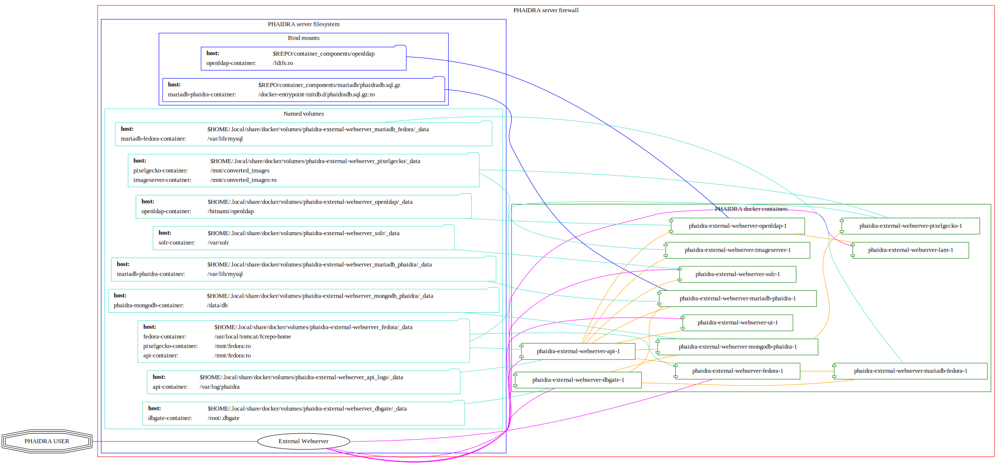

[[_TOC_]]

# Build status

We have a minimal CI activated (see the status badge above) – right now
it only builds the docker images as defined in the `./dockerfiles`
directory. This is for testing purposes and runs on every commit to this
repo, as a semi-manual verification if any cpanm-modules break the
api-build.

# About this repository

This repo hosts the source code and docker-compose files of the
[PHAIDRA](https://phaidra.org/) (Permanent Hosting, Archiving and
Indexing of Digital Resources and Assets) software, developed at the
[Vienna University Computer Center](https://zid.univie.ac.at/en/).

The aim of this project is to provide a high-quality, easy-to-set-up
web-based digital archiving system for academic institutions and other
organizations that need to provide a solution for long-term-archiving of
valuable data.

We provide various flavors for different use cases, from a demo version
running on a local desktop computer for evaluation, to an SSO-enabled
server version.

# Software in use

[PHAIDRA](https://phaidra.org/) is based on the shoulders of the
following great pieces of software (in alphabetical order):

-   [Alpine Linux](https://www.alpinelinux.org/)
-   [Apache](https://apache.org/)
-   [Apache Solr](https://solr.apache.org/)
-   [DbGate](https://dbgate.org/)
-   [Debian](https://www.debian.org/)
-   [Docker](https://www.docker.com/)
-   [LDAP Account Manager](https://www.ldap-account-manager.org/lamcms/)
-   [Lyrasis Fedora](https://fedora.lyrasis.org/)
-   [MariaDB](https://mariadb.org/)
-   [MongoDB](https://www.mongodb.com/)
-   [Nginx](https://nginx.org/)
-   [OpenLDAP](https://www.openldap.org/)
-   [Perl](https://www.perl.org/)
-   [Shibboleth](https://www.shibboleth.net/)
-   [Ubuntu](https://ubuntu.com/)
-   [Vue.js](https://vuejs.org/)

# Setup

## Prerequisites

For all versions you will need a recent [Docker
Installation](https://docs.docker.com/engine/install/), ideally on a
Linux distribution (PHAIDRA is mainly developed on Ubuntu and Debian).
Below you see what we use at the time of writing (Fri Sep 15 01:18:31 PM
CEST 2023):

``` bash
docker version
```

``` example
Client: Docker Engine - Community
 Version:           24.0.6
 API version:       1.43
 Go version:        go1.20.7
 Git commit:        ed223bc
 Built:             Mon Sep  4 12:32:16 2023
 OS/Arch:           linux/amd64
 Context:           rootless

Server: Docker Engine - Community
 Engine:
  Version:          24.0.6
  API version:      1.43 (minimum version 1.12)
  Go version:       go1.20.7
  Git commit:       1a79695
  Built:            Mon Sep  4 12:32:16 2023
  OS/Arch:          linux/amd64
  Experimental:     false
 containerd:
  Version:          1.6.22
  GitCommit:        8165feabfdfe38c65b599c4993d227328c231fca
 runc:
  Version:          1.1.8
  GitCommit:        v1.1.8-0-g82f18fe
 docker-init:
  Version:          0.19.0
  GitCommit:        de40ad0
 rootlesskit:
  Version:          1.1.1
  ApiVersion:       1.1.1
  NetworkDriver:    slirp4netns
  PortDriver:       slirp4netns
  StateDir:         /tmp/rootlesskit1559358571
 slirp4netns:
  Version:          1.2.0
  GitCommit:        656041d45cfca7a4176f6b7eed9e4fe6c11e8383
```

``` bash
docker info
```

``` example
Client: Docker Engine - Community
 Version:    24.0.6
 Context:    rootless
 Debug Mode: false
 Plugins:
  buildx: Docker Buildx (Docker Inc.)
    Version:  v0.11.2
    Path:     /usr/libexec/docker/cli-plugins/docker-buildx
  compose: Docker Compose (Docker Inc.)
    Version:  v2.21.0
    Path:     /usr/libexec/docker/cli-plugins/docker-compose

Server:
 Containers: 14
  Running: 13
  Paused: 0
  Stopped: 1
 Images: 20
 Server Version: 24.0.6
 Storage Driver: fuse-overlayfs
 Logging Driver: json-file
 Cgroup Driver: systemd
 Cgroup Version: 2
 Plugins:
  Volume: local
  Network: bridge host ipvlan macvlan null overlay
  Log: awslogs fluentd gcplogs gelf journald json-file local logentries splunk syslog
 Swarm: inactive
 Runtimes: io.containerd.runc.v2 runc
 Default Runtime: runc
 Init Binary: docker-init
 containerd version: 8165feabfdfe38c65b599c4993d227328c231fca
 runc version: v1.1.8-0-g82f18fe
 init version: de40ad0
 Security Options:
  seccomp
   Profile: builtin
  rootless
  cgroupns
 Kernel Version: 6.1.0-12-amd64
 Operating System: Debian GNU/Linux 12 (bookworm)
 OSType: linux
 Architecture: x86_64
 CPUs: 8
 Total Memory: 15.03GiB
 Name: pcherzigd64
 ID: 4d080886-f0a3-4478-bac7-ebadf0ccfd68
 Docker Root Dir: /home/daniel/.local/share/docker
 Debug Mode: false
 Experimental: false
 Insecure Registries:
  127.0.0.0/8
 Live Restore Enabled: false

```

As one can see above, we are using Docker's rootlesskit, to avoid
uneccessary privileges for the dockerized components. This also means,
that the user starting up the program does not need root/admin
privileges on the machine running PHAIDRA.

Nevertheless, setting up Docker itself will need a system admin user.
Below we describe the steps that we use for rootless Docker with
priviledged ports and (needed for http and https traffic on the
SSL-enabled versions) and client-IP forwarding (needed for restricting
access to parts of the system).

### set up rootlesskit

Assuming you have a running standard Docker installation you can either
continue that way, as it should not interfere with the code of this
repo. We however recommend using docker rootless to stay in sync with
this repo's documentation. There is extensive official [upstream
documentation](https://docs.docker.com/engine/security/rootless/) how to
do that – below you find what we do for a typical installation.

1.  turn off running priviledged docker service

    ``` example
    sudo systemctl disable --now docker.service docker.socket
    sudo reboot
    ```

2.  install uidmap package

    The `uidmap` package is available in both ubuntu and Debian official
    repositories and is needed for Docker's rootlesskit to properly
    function.

    ``` example
    sudo apt install uidmap
    ```

3.  install rootlesskit

    ``` example
    dockerd-rootless-setuptool.sh
    # activate autostart of services
    sudo loginctl enable-linger $USER
    echo "export DOCKER_HOST=unix:///run/user/$(id -u)/docker.sock" >> ~/.bashrc
    # needed at least on headless ubuntu systems
    echo "export XDG_RUNTIME_DIR=/run/user/$(id -u)" >> ~/.bashrc
    ```

4.  change port-forwarding mode for rootlesskit to slirp4netns

    In order to receive the original client IPs accessing the webserver,
    we change the port-forwarding mode of the rootlesskit (the default
    one drops IPs and nginx/apache only receive the docker
    network-bridge address, which does not allow for IP-filtering
    administrative parts of the system as a consequence).

    ``` example
    mkdir ~/.config/systemd/user/docker.service.d
    echo "[Service]" >> ~/.config/systemd/user/docker.service.d/override.conf
    echo 'Environment="DOCKERD_ROOTLESS_ROOTLESSKIT_PORT_DRIVER=slirp4netns"' >> ~/.config/systemd/user/docker.service.d/override.conf
    systemctl --user daemon-reload
    systemctl --user restart docker
    ```

5.  allow priviledged ports for slirp4netns

    To allow opening ports 80 and 443 for unpriviledged slirp4netns we
    need to dedicately allow it (setcap will not work for this):

    ``` example
    echo "net.ipv4.ip_unprivileged_port_start=0" | sudo tee /etc/sysctl.d/99-rootless.conf
    sudo sysctl --system
    ```

6.  add cpuset support

    By default docker cpuset limitations are not enabled for rootless
    configurations. One can do the following to change this. (see:
    <https://docs.docker.com/engine/security/rootless/#limiting-resources>)

    ``` example
    cat /sys/fs/cgroup/user.slice/user-$(id -u).slice/user@$(id -u).service/cgroup.controllers
    cpu memory pids
    sudo su -
    mkdir -p /etc/systemd/system/user@.service.d
    cat > /etc/systemd/system/user@.service.d/delegate.conf << EOF
    > [Service]
    > Delegate=cpu cpuset io memory pids
    > EOF
    systemctl daemon-reload
    exit
    cat /sys/fs/cgroup/user.slice/user-$(id -u).slice/user@$(id -u).service/cgroup.controllers
    cpuset cpu io memory pids
    systemctl --user restart docker
    ```

    ``` example
    .
    ├── components
    ├── compose_demo
    ├── compose_shibboleth
    ├── compose_ssl
    ├── compose_webserver_ext
    ├── container_components
    ├── dockerfiles
    ├── encryption
    ├── image_components
    ├── pictures
    ├── shibboleth
    └── webserver_configs

    13 directories
    ```

    We currently have an [automated installer for
    phaidra](https://gitlab.phaidra.org/phaidra-dev/phaidra-demo), which
    allows to set up an instance in about 15min. However, setup is still
    bound to the underlying operating system (Ubuntu 22.04-LTS), which
    brings quite some complexity to the end-user. Here we try to
    abstract the system further and allow for easier integration into
    CI/CD workflows using containerization via docker, and to achieve
    better portability to other platforms supporting this kind of
    containerization.

    The goal of this project is to allow an interested person to run the
    command `docker compose up -d` from a clone of this repo and have
    phaidra running on his/her computer, without modifying the computer
    (and have things easily removed with `docker compose down` as well).

# Graphical overview

## Demo

System when running `docker compose up -d` from directory `./demo_nginx`
(Phaidra available on `http://localhost:8899`.).



## SSL

System when running `docker compose up -d` from directory `./ssl_nginx`
(Phaidra available on `https://$YOUR_FQDN`, see section 'System startup'
below for prerequisites).



## Shibboleth



## External webserver

System when running `docker compose up -d` from directory
`./external_webserver` (Phaidra available on `http(s)://$YOUR_FQDN`, see
section 'System startup' below for prerequisites).



# System startup

This repo holds four phaidra flavors at the moment. Three of them depend
solely on docker (they include nginx and apache respectively, but depend
on the same phaidra-code).

## testing/dev

To start up a local testinstance of phaidra, which will run on
<http://localhost:8899> you need this repo on your computer and then run
`docker compose up -d` from either the `demo_httpd` folder (starts
phaidra with apache2 as webserver), or the `demo_nginx` folder (which,
well uses nginx as webserver). Depending on your internet connection and
PC power, the set up will last about 10-30min.

## productive/ssl

If you want to spin up a productive version of phaidra, you will
additionaly need the following things:

-   A DNS-entry for your host's IP.
-   SSL-certificate and -key (put them into the certs-folder of this
    repo and name them `privkey.pem` and `fullchain.pem`).
-   firewall with port 80 and 443 open.

Once you've got these prerequisites, change into the `ssl_nginx`
directory of this repo, put FQDN and IP into the lower section of the
`.env` file (in the `prod_nginx` directory) and run
`docker compose up -d` from there. We currently work on the same for
apache2. Depending on your internet connection and PC power, the set up
will last about 10-30min.

## using an external webserver

If you prefer to use your own webserver, that is already installed on
your system, this is also possible:

There is [an nginx configuration file in this
repo](./webserver_configs/nginx-external/phaidra-nginx.conf), that can
be copied to `/etc/nginx/sites-available` and symlinked to
`/etc/nginx/sites-enabled/`. Unlink the default config and restart nginx
(`sudo systemctl restart nginx.service`) to have it ready for the
dockerized phaidra system. If you change stuff, or just want to verify
run `sudo nginx -t` to debug the configuration.

Also, you will find [an apache configuration file in this
repo](./webserver_configs/apache-external/phaidra-apache.conf).
Activation is slightly more complicated than with nginx, but should be
feasable, if one has worked with apache before (we need features not
activated by default, but they're included with the standard modules).
First, run `echo "Listen 8899" | sudo tee -a /etc/apache2/ports.conf` to
give apache the chance to listen on port 8899 (where our dev-version
serves). Then activate the necessary modules with
`sudo a2enmod proxy proxy_http`. As a last step copy the config file to
`/etc/apache2/sites-available`, disable the default configuration and
run `sudo a2ensite phaidra-apache.conf` followed by
`sudo systemctl restart apache2.service`. If you change stuff, or just
want to verify run `sudo apachectl configtest` to debug the
configuration.

If you visit <http://localhost:8899> you will get a
`502 Bad Gateway`-Error for nginx and a (slightly more comprehensive)
`Service unavailable` for apache in your browser. That is fine, PHAIDRA
has not been started yet.

Change to the `external_webserver` directory in this repo and run
`docker compose up -d` to start it up. At first run, this command will
run for a few minutes, as some images will have to be downloaded and
partly built as well.

NOTE: If you make changes to files mentioned in the `dockerfiles`
directory of this repo, make sure to remove the built images before
running `docker compose up -d`. Otherwise you will keep on using the old
images and notice not difference. E.g. if one does a change to
`components/phaidra-api/PhaidraAPI.json` one will also have to run
`docker rmi phaidra-docker-phaidra-api` to have it rebuilt on a new
startup.

## running containers after startup

After starting the program you should see the following containers
running:

``` example
daniel@pcherzigd64:~/gitlab.phaidra.org/phaidra-dev/phaidra-docker$ docker ps
CONTAINER ID   IMAGE                                  COMMAND                  CREATED         STATUS                            PORTS                                       NAMES
66000e95199e   phaidra-ui                             "npm run start"          4 seconds ago   Up 1 second                       0.0.0.0:3001->3001/tcp, :::3001->3001/tcp   phaidra-ui-1
2b3a7bdfa4ee   phaidra-pixelgecko                     "perl pixelgecko.pl …"   4 seconds ago   Up 1 second                                                                   phaidra-pixelgecko-1
500a9b42b8c9   phaidra-api                            "hypnotoad -f phaidr…"   4 seconds ago   Up 2 seconds                      0.0.0.0:3000->3000/tcp, :::3000->3000/tcp   phaidra-api-1
6afdad0abd8c   dbgate/dbgate:5.2.5                    "docker-entrypoint.s…"   4 seconds ago   Up 2 seconds                      0.0.0.0:7777->3000/tcp, :::7777->3000/tcp   phaidra-dbgate-1
ff1982420f09   phaidra-solr                           "docker-entrypoint.s…"   4 seconds ago   Up 2 seconds                      0.0.0.0:8983->8983/tcp, :::8983->8983/tcp   phaidra-solr-1
7e5ba84114cc   fcrepo/fcrepo:6.4.0                    "catalina.sh run"        4 seconds ago   Up 2 seconds                      0.0.0.0:9999->8080/tcp, :::9999->8080/tcp   phaidra-fedora-1
cd3ba700db29   mongo:5                                "docker-entrypoint.s…"   4 seconds ago   Up 3 seconds                      27017/tcp                                   phaidra-mongodb-phaidra-1
4909c7ef8002   mariadb:10.5                           "docker-entrypoint.s…"   4 seconds ago   Up 3 seconds                      3306/tcp                                    phaidra-mariadb-fedora-1
0a1466876040   ghcr.io/ldapaccountmanager/lam:8.4     "/usr/bin/dumb-init …"   4 seconds ago   Up 2 seconds (health: starting)   0.0.0.0:8888->80/tcp, :::8888->80/tcp       phaidra-lam-1
a0889d7dc75b   mariadb:11.0.2-jammy                   "docker-entrypoint.s…"   4 seconds ago   Up 3 seconds                      3306/tcp                                    phaidra-mariadb-phaidra-1
86e86def9f8d   phaidra-imageserver                    "/usr/sbin/apachectl…"   4 seconds ago   Up 3 seconds                      0.0.0.0:8081->80/tcp, :::8081->80/tcp       phaidra-imageserver-1
5269bd16590a   bitnami/openldap:2.6.4-debian-11-r44   "/opt/bitnami/script…"   4 seconds ago   Up 3 seconds                      1389/tcp, 1636/tcp                          phaidra-openldap-1
```

## available webservices after startup

-   PHAIDRA web-interface at <http://localhost:8899> (available in your
    network).
-   PHAIDRA API at <http://localhost:8899/api> (available in your
    network).
-   Webinterface to view, query (and if you for some reason need to –
    manipulate) the databases at <http://localhost:8899/dbgate>
    (available on your computer only).
-   Webinterface to manage users at <http://localhost:8899/lam>
    (available on your computer only, default credentials
    admin/adminpassword).
-   Webinterface to Apache Solr at <http://localhost:8899/solr>
    (available on your computer only).
-   Webinterface to the underlying datastore at
    <http://localhost:8899/fcrepo> (available on your computer only,
    default credentials fedoraAdmin/fedoraAdmin).

## new folders on your system after startup

`docker compose up -d` will create directories in
`$HOME/.local/share/docker/volumes` to store data created by PHAIDRA
over system shutdowns, etc. After startup it should look like this:

``` example
daniel@pcherzigd64:~/gitlab.phaidra.org/phaidra-dev/phaidra-docker$ docker volume ls --filter label=com.docker.compose.project=phaidra
DRIVER    VOLUME NAME
local     phaidra_api_logs
local     phaidra_dbgate
local     phaidra_fedora
local     phaidra_mariadb_fedora
local     phaidra_mariadb_phaidra
local     phaidra_mongodb_phaidra
local     phaidra_openldap
local     phaidra_pixelgecko
local     phaidra_solr
## sample volume inspection
daniel@pcherzigd64:~/gitlab.phaidra.org/phaidra-dev/phaidra-docker$ docker volume inspect phaidra_api_logs 
[
    {
        "CreatedAt": "2023-07-07T14:02:51+02:00",
        "Driver": "local",
        "Labels": {
            "com.docker.compose.project": "phaidra",
            "com.docker.compose.version": "2.18.1",
            "com.docker.compose.volume": "api_logs"
        },
        "Mountpoint": "/home/daniel/.local/share/docker/volumes/phaidra_api_logs/_data",
        "Name": "phaidra_api_logs",
        "Options": null,
        "Scope": "local"
    }
]
## listing the directories the 'standard way'
daniel@pcherzigd64:~/gitlab.phaidra.org/phaidra-dev/phaidra-docker$ ls -lha ~/.local/share/docker/volumes/phaidra*
/home/daniel/.local/share/docker/volumes/phaidra_api_logs:
total 88K
drwx-----x   3 daniel daniel 4.0K Jul  7 14:02 .
drwx-----x 710 daniel daniel  76K Jul  7 14:05 ..
drwxr-xr-x   2 daniel daniel 4.0K Jul  7 14:06 _data

/home/daniel/.local/share/docker/volumes/phaidra_dbgate:
total 88K
drwx-----x   3 daniel daniel 4.0K Jul  7 14:02 .
drwx-----x 710 daniel daniel  76K Jul  7 14:05 ..
drwxr-xr-x   5 daniel daniel 4.0K Jul  7 14:02 _data

/home/daniel/.local/share/docker/volumes/phaidra_fedora:
total 88K
drwx-----x   3 daniel daniel 4.0K Jul  7 14:02 .
drwx-----x 710 daniel daniel  76K Jul  7 14:05 ..
drwxr-xr-x   3 daniel daniel 4.0K Jul  7 14:03 _data

/home/daniel/.local/share/docker/volumes/phaidra_mariadb_fedora:
total 88K
drwx-----x   3 daniel daniel 4.0K Jul  7 14:02 .
drwx-----x 710 daniel daniel  76K Jul  7 14:05 ..
drwxr-xr-x   5 100998 100998 4.0K Jul  7 14:06 _data

/home/daniel/.local/share/docker/volumes/phaidra_mariadb_phaidra:
total 88K
drwx-----x   3 daniel daniel 4.0K Jul  7 14:02 .
drwx-----x 710 daniel daniel  76K Jul  7 14:05 ..
drwxr-xr-x   6 100998 100998 4.0K Jul  7 14:06 _data

/home/daniel/.local/share/docker/volumes/phaidra_mongodb_phaidra:
total 88K
drwx-----x   3 daniel daniel 4.0K Jul  7 14:02 .
drwx-----x 710 daniel daniel  76K Jul  7 14:05 ..
drwxr-xr-x   4 100998 100998 4.0K Jul  7 14:06 _data

/home/daniel/.local/share/docker/volumes/phaidra_openldap:
total 88K
drwx-----x   3 daniel daniel 4.0K Jul  7 14:02 .
drwx-----x 710 daniel daniel  76K Jul  7 14:05 ..
drwxr-xr-x   4 daniel daniel 4.0K Jul  7 14:02 _data

/home/daniel/.local/share/docker/volumes/phaidra_pixelgecko:
total 88K
drwx-----x   3 daniel daniel 4.0K Jul  7 14:02 .
drwx-----x 710 daniel daniel  76K Jul  7 14:05 ..
drwxr-xr-x   2 daniel daniel 4.0K Jul  7 14:02 _data

/home/daniel/.local/share/docker/volumes/phaidra_solr:
total 88K
drwx-----x   3 daniel daniel 4.0K Jul  7 14:02 .
drwx-----x 710 daniel daniel  76K Jul  7 14:05 ..
drwxrwx---   4 108982 daniel 4.0K Jul  7 14:02 _data
## check volume sizes
daniel@pcherzigd64:~/gitlab.phaidra.org/phaidra-dev/phaidra-docker$ sudo du -sh ~/.local/share/docker/volumes/phaidra_*
[sudo] password for daniel: 
16K    /home/daniel/.local/share/docker/volumes/phaidra_api_logs
32K    /home/daniel/.local/share/docker/volumes/phaidra_dbgate
320K   /home/daniel/.local/share/docker/volumes/phaidra_fedora
138M   /home/daniel/.local/share/docker/volumes/phaidra_mariadb_fedora
174M   /home/daniel/.local/share/docker/volumes/phaidra_mariadb_phaidra
301M   /home/daniel/.local/share/docker/volumes/phaidra_mongodb_phaidra
212K   /home/daniel/.local/share/docker/volumes/phaidra_openldap
8.0K   /home/daniel/.local/share/docker/volumes/phaidra_pixelgecko
440K   /home/daniel/.local/share/docker/volumes/phaidra_solr
```

You might notice that inspecting the actual sizes of the directories
requires `sudo` – this is due to the fact that solr, mariadb, and
mongodb volumes make use of a separate user from within the container.
The UIDs all come from the range your user is allowed to assign to using
the `newuidmap` and `newgidmap` programs deriving from the `uidmap`
package mentioned under system requirements. One can see this as a
reminder to be careful when manipulating this kind of data (at least the
databases can be manipulated from <http://localhost:8899/dbgate> without
special permissions).

## monitoring container system usage

One can use the following command to real-time monitor the system usage
of phaidra over all containers (here from an instance started from
`demo_nginx`):

``` example
docker stats<<<$(docker ps -q)
CONTAINER ID   NAME                                   CPU %     MEM USAGE / LIMIT     MEM %     NET I/O           BLOCK I/O         PIDS
ae0608348349   phaidra-demo-nginx-nginx-1             0.00%     8.188MiB / 15.03GiB   0.05%     142kB / 138kB     0B / 0B           9
e3c61e4d2495   phaidra-demo-nginx-ui-1                0.00%     124.8MiB / 15.03GiB   0.81%     4.08kB / 118kB    0B / 0B           23
6f60f3ef3a15   phaidra-demo-nginx-pixelgecko-1        0.00%     51.47MiB / 15.03GiB   0.33%     97.9kB / 209kB    0B / 0B           1
b2bb3d0cda66   phaidra-demo-nginx-api-1               0.12%     233.6MiB / 15.03GiB   1.52%     19.7kB / 28.9kB   0B / 0B           5
6be6bea11f85   phaidra-demo-nginx-dbgate-1            0.00%     24.93MiB / 15.03GiB   0.16%     1.73kB / 224B     0B / 4.1kB        12
ca762fea79fe   phaidra-demo-nginx-fedora-1            0.47%     632.5MiB / 15.03GiB   4.11%     17.9kB / 15.2kB   0B / 860kB        55
c0ca084bda76   phaidra-demo-nginx-solr-1              0.87%     732MiB / 15.03GiB     4.76%     2.94kB / 3.04kB   0B / 164kB        54
ba967011b666   phaidra-demo-nginx-mariadb-phaidra-1   0.02%     110.7MiB / 15.03GiB   0.72%     1.85kB / 0B       14.5MB / 8.19kB   8
b636bab73219   phaidra-demo-nginx-mongodb-phaidra-1   0.50%     172.2MiB / 15.03GiB   1.12%     221kB / 105kB     0B / 1.81MB       37
96705e89810b   phaidra-demo-nginx-mariadb-fedora-1    0.02%     96.67MiB / 15.03GiB   0.63%     17kB / 16.5kB     0B / 8.19kB       18
2806bbd31aeb   phaidra-demo-nginx-openldap-1          0.00%     20.63MiB / 15.03GiB   0.13%     3.17kB / 1.46kB   0B / 0B           4
e0004d097ebb   phaidra-demo-nginx-imageserver-1       0.01%     23.73MiB / 15.03GiB   0.15%     1.78kB / 0B       0B / 0B           57
343c3af188c1   phaidra-demo-nginx-lam-1               0.01%     25.56MiB / 15.03GiB   0.17%     1.62kB / 0B       0B / 0B           8
```

# real time system usage logging

To see which containers are using which amount of CPU and RAM and
network I/O you can use the following command:

``` example
docker ps --quiet | xargs docker stats ## from anywhere
CONTAINER ID   NAME                        CPU %     MEM USAGE / LIMIT     MEM %     NET I/O           BLOCK I/O   PIDS
455ad9777d42   phaidra-ui-1                0.00%     135MiB / 15.03GiB     0.88%     13.5kB / 125kB    0B / 0B     23
025d5c342c1c   phaidra-pixelgecko-1        0.00%     78.43MiB / 15.03GiB   0.51%     186kB / 401kB     0B / 0B     1
7346d39eb84d   phaidra-pixelgecko-3        0.00%     78.57MiB / 15.03GiB   0.51%     185kB / 399kB     0B / 0B     1
4ee9c8cabda9   phaidra-pixelgecko-2        0.00%     51.49MiB / 15.03GiB   0.33%     185kB / 397kB     0B / 0B     1
0941b6d5bb52   phaidra-pixelgecko-4        0.00%     78.62MiB / 15.03GiB   0.51%     186kB / 401kB     0B / 0B     1
9fff2d288c4c   phaidra-api-1               0.01%     308.3MiB / 15.03GiB   2.00%     980kB / 1.24MB    0B / 0B     5
bfa27c63e834   phaidra-dbgate-1            0.00%     24.83MiB / 15.03GiB   0.16%     2.08kB / 224B     0B / 0B     12
8bd0ac73790f   phaidra-fedora-1            0.29%     732MiB / 15.03GiB     4.76%     412kB / 397kB     0B / 0B     61
885a8d01ec2c   phaidra-solr-1              0.90%     741.2MiB / 15.03GiB   4.82%     29.2kB / 68.1kB   0B / 0B     54
12228f49c27f   phaidra-mariadb-phaidra-1   0.02%     231.1MiB / 15.03GiB   1.50%     3.68kB / 1.22kB   0B / 0B     11
e5445ae621c8   phaidra-lam-1               0.00%     25.67MiB / 15.03GiB   0.17%     2.01kB / 0B       0B / 0B     8
9d4eb920bf7c   phaidra-mariadb-fedora-1    0.02%     92.2MiB / 15.03GiB    0.60%     156kB / 137kB     0B / 0B     18
452ef909aedf   phaidra-openldap-1          0.00%     22.67MiB / 15.03GiB   0.15%     41.1kB / 44.3kB   0B / 0B     4
3046ff568558   phaidra-mongodb-phaidra-1   0.50%     189.2MiB / 15.03GiB   1.23%     1.72MB / 828kB    0B / 0B     45
6071bb9f8544   phaidra-imageserver-1       0.00%     32.39MiB / 15.03GiB   0.21%     14.4kB / 226kB    0B / 0B     65
```

# Complete cleanup

MATTER OF CHANGE. During development things can become very cluttered. A
pretty complete cleanup (at the cost of an image rebuild) can be
achieved by running the following commands:

``` example
# shut down and remove running containers (from the repo directory)
docker compose down

# remove persisted data from previous runs (from anywhere)
docker volume rm $(docker volume ls --filter label=com.docker.compose.project=phaidra --quiet)

# cleanup docker matter (build caches, images..., from anywhere)
docker system prune --all
```

# <span class="todo TODO">TODO</span> Known issues

We keep searching.

There's hardcoded 'https' in the following occurences in the phaidra-ui
components:

``` example
/home/daniel/gitlab.phaidra.org/phaidra-dev/phaidra-docker/components/phaidra-ui/server-middleware/redirect.js:              redirect(res, 'https://' + config.instances[config.defaultinstance].irbaseurl + '/' + pid)
/home/daniel/gitlab.phaidra.org/phaidra-dev/phaidra-docker/components/phaidra-ui/server-middleware/redirect.js:      redirect(res, 'https://' + config.instances[config.defaultinstance].baseurl + '/detail/' + pid)
/home/daniel/gitlab.phaidra.org/phaidra-dev/phaidra-docker/components/phaidra-ui/pages/upload-webversion/_pid.vue:                {{ $t('WEBVERSIONSUBMIT', { pid: 'https://' + instanceconfig.baseurl + '/' + parentpid }) }}
/home/daniel/gitlab.phaidra.org/phaidra-dev/phaidra-docker/components/phaidra-ui/pages/detail/_pid.vue:        "https://" + this.instanceconfig.irbaseurl + "/" + this.objectInfo.pid
/home/daniel/gitlab.phaidra.org/phaidra-dev/phaidra-docker/components/phaidra-ui/pages/detail/_pid.vue:          "https://" + this.instanceconfig.baseurl + "/" + this.objectInfo.pid,
/home/daniel/gitlab.phaidra.org/phaidra-dev/phaidra-docker/components/phaidra-ui/pages/detail/_pid.vue:              "https://" +
/home/daniel/gitlab.phaidra.org/phaidra-dev/phaidra-docker/components/phaidra-ui/pages/detail/_pid.vue:          url: "https://" + this.appconfig.apis.doi.baseurl + "/" + this.doi,
/home/daniel/gitlab.phaidra.org/phaidra-dev/phaidra-docker/components/phaidra-ui/pages/detail/_pid.vue:          url: "https://" + this.appconfig.apis.doi.baseurl + "/" + this.doi,
```

This boils down to the three files:

-   `components/phaidra-ui/pages/detail/_pid.vue`
-   `components/phaidra-ui/pages/upload-webversion/_pid.vue`
-   `components/phaidra-ui/server-middleware/redirect.js`

In phaidra-vue-components we find:

``` example
/home/daniel/gitlab.phaidra.org/phaidra-dev/phaidra-docker/components/phaidra-vue-components/src/components/lists/PLists.vue:            <template v-if="token && token.length > 0"><a class="pl-2 white--text" target="_blank" :href="'/list/' + token">{{ 'https://' + instance.baseurl + '/list/' + token }}</a></template>
/home/daniel/gitlab.phaidra.org/phaidra-dev/phaidra-docker/components/phaidra-vue-components/src/components/input/PISubjectGnd.vue:          url: 'https://' + this.$store.state.appconfig.apis.lobid.baseurl + '/gnd/search',
/home/daniel/gitlab.phaidra.org/phaidra-dev/phaidra-docker/components/phaidra-vue-components/src/components/display/PDJsonld.vue:        <v-col :md="valueColMd" cols="12">https://{{ instance.baseurl }}/{{ pid }}</v-col>

/home/daniel/gitlab.phaidra.org/phaidra-dev/phaidra-docker/components/phaidra-vue-components/src/components/search/PSearchResults.vue:                <span>https://{{ instance.baseurl }}/{{ doc.pid }}</span>
/home/daniel/gitlab.phaidra.org/phaidra-dev/phaidra-docker/components/phaidra-vue-components/src/components/management/PMDelete.vue:      <div v-else>{{ $t('DELETE_OBJECT', { pid: 'https://' + instance.baseurl + '/' + pid }) }}</div>
/home/daniel/gitlab.phaidra.org/phaidra-dev/phaidra-docker/components/phaidra-vue-components/src/components/management/PMDelete.vue:          <v-card-text>{{ $t('DELETE_OBJECT_CONFIRM', { pid: 'https://' + instance.baseurl + '/' +  pid })}}</v-card-text>
/home/daniel/gitlab.phaidra.org/phaidra-dev/phaidra-docker/components/phaidra-vue-components/src/components/management/PMRelationships.vue:                <a target="_blank" :href="'https://' + instance.baseurl + '/' + item.object">{{ item.object }}</a>
/home/daniel/gitlab.phaidra.org/phaidra-dev/phaidra-docker/components/phaidra-vue-components/src/components/select/RorSearch.vue:          url: 'https://' + this.$store.state.appconfig.apis.ror.baseurl + '/organizations',
/home/daniel/gitlab.phaidra.org/phaidra-dev/phaidra-docker/components/phaidra-vue-components/src/components/browse/PCollectionGallery.vue:                   <v-img aspect-ratio="1" :src="'https://' + instanceconfig.baseurl + '/preview/' + doc.pid" @click="showDetailDialog(doc)"></v-img>
/home/daniel/gitlab.phaidra.org/phaidra-dev/phaidra-docker/components/phaidra-vue-components/src/components/browse/PCollectionGallery.vue:                      <v-img class="grey lighten-2" aspect-ratio="1" :src="'https://' + instanceconfig.baseurl + '/preview/' + doc.pid"
/home/daniel/gitlab.phaidra.org/phaidra-dev/phaidra-docker/components/phaidra-vue-components/src/components/browse/PCollectionGallery.vue:          <v-img aspect-ratio="1" :src="'https://' + instanceconfig.baseurl + '/preview/' + detailToShow.pid"></v-img>
/home/daniel/gitlab.phaidra.org/phaidra-dev/phaidra-docker/components/phaidra-vue-components/src/components/browse/PCollectionGallery.vue:        //  alert('https://' + this.instanceconfig.baseurl + '/preview/' + doc.pid);
```

# Phaidra Components

In the folder `./components` one will find `phaidra-api`, `phaidra-ui`,
and `phaidra-vue-components`. These are copies of the public github
repos, adapted for use in the docker context here. See the notes in the
following subsections.

## phaidra-api

This is a checkout of commit c880c4159c5d68b25426451f4822f744a53ef680 of
the repo at <https://github.com/phaidra/phaidra-api> with symlinks and
git history stripped:

``` example
daniel@pcherzigd64:~/gitlab.phaidra.org/phaidra-dev/phaidra-docker/components/phaidra-api$ git log -n1
commit c880c4159c5d68b25426451f4822f744a53ef680 (HEAD -> master, origin/master)
Author: Rasta <hudak.rastislav@gmail.com>
Date:   Mon May 22 16:08:59 2023 +0200

    avoiding empty eq
daniel@pcherzigd64:~/gitlab.phaidra.org/phaidra-dev/phaidra-docker/components/phaidra-api$ find . -type l
./public/xsd/uwmetadata
./log4perl.conf
daniel@pcherzigd64:~/gitlab.phaidra.org/phaidra-dev/phaidra-docker/components/phaidra-api$ find . -type l -exec rm -v {} \;
removed './public/xsd/uwmetadata'
removed './log4perl.conf'
daniel@pcherzigd64:~/gitlab.phaidra.org/phaidra-dev/phaidra-docker/components/phaidra-api$ rm -v .gitignore && rm -rv .git
removed '.gitignore'
removed directory '.git/refs/tags'
removed '.git/refs/heads/master'
removed directory '.git/refs/heads'
removed directory '.git/refs/remotes'
removed directory '.git/refs'
removed '.git/info/exclude'
removed directory '.git/info'
removed '.git/HEAD'
removed '.git/index'
removed '.git/hooks/applypatch-msg.sample'
removed '.git/hooks/pre-commit.sample'
removed '.git/hooks/push-to-checkout.sample'
removed '.git/hooks/post-update.sample'
removed '.git/hooks/pre-merge-commit.sample'
removed '.git/hooks/update.sample'
removed '.git/hooks/commit-msg.sample'
removed '.git/hooks/pre-push.sample'
removed '.git/hooks/pre-applypatch.sample'
removed '.git/hooks/pre-rebase.sample'
removed '.git/hooks/pre-receive.sample'
removed '.git/hooks/fsmonitor-watchman.sample'
removed '.git/hooks/prepare-commit-msg.sample'
removed directory '.git/hooks'
removed '.git/config'
rm: remove write-protected regular file '.git/objects/pack/pack-7e94ef195971c977ba26038f46db4d3026adbcc7.pack'? yes
removed '.git/objects/pack/pack-7e94ef195971c977ba26038f46db4d3026adbcc7.pack'
rm: remove write-protected regular file '.git/objects/pack/pack-7e94ef195971c977ba26038f46db4d3026adbcc7.idx'? yes
removed '.git/objects/pack/pack-7e94ef195971c977ba26038f46db4d3026adbcc7.idx'
removed directory '.git/objects/pack'
removed directory '.git/objects/info'
removed directory '.git/objects'
removed directory '.git/branches'
removed '.git/logs/refs/heads/master'
removed directory '.git/logs/refs/heads'
removed directory '.git/logs/refs/remotes'
removed directory '.git/logs/refs'
removed '.git/logs/HEAD'
removed directory '.git/logs'
removed '.git/packed-refs'
removed '.git/description'
removed directory '.git'
```

## phaidra-ui

This is a checkout of commit 5c9455373d36f4756e9caa2af989fac4dbd28f9f of
the repo at <https://github.com/phaidra/phaidra-ui> with symlinks and
git history stripped:

``` example
daniel@pcherzigd64:~/gitlab.phaidra.org/phaidra-dev/phaidra-docker/components/phaidra-ui$ git log -n1
commit 5c9455373d36f4756e9caa2af989fac4dbd28f9f (HEAD -> master, origin/master)
Merge: 63d4278 eca211f
Author: Phaidra Devel (phaidra2) <phaidra.devel@univie.ac.at>
Date:   Tue May 9 14:21:44 2023 +0200

    Merge branch 'master' of github.com:phaidra/phaidra-ui
daniel@pcherzigd64:~/gitlab.phaidra.org/phaidra-dev/phaidra-docker/components/phaidra-ui$ find . -type l -exec rm -v {} \;
removed './config/phaidra-ui.js'
daniel@pcherzigd64:~/gitlab.phaidra.org/phaidra-dev/phaidra-docker/components/phaidra-ui$ rm .gitignore 
daniel@pcherzigd64:~/gitlab.phaidra.org/phaidra-dev/phaidra-docker/components/phaidra-ui$ rm -rfv .git
removed directory '.git/refs/tags'
removed '.git/refs/heads/master'
removed directory '.git/refs/heads'
removed directory '.git/refs/remotes'
removed directory '.git/refs'
removed '.git/info/exclude'
removed directory '.git/info'
removed '.git/HEAD'
removed '.git/index'
removed '.git/hooks/applypatch-msg.sample'
removed '.git/hooks/pre-commit.sample'
removed '.git/hooks/push-to-checkout.sample'
removed '.git/hooks/post-update.sample'
removed '.git/hooks/pre-merge-commit.sample'
removed '.git/hooks/update.sample'
removed '.git/hooks/commit-msg.sample'
removed '.git/hooks/pre-push.sample'
removed '.git/hooks/pre-applypatch.sample'
removed '.git/hooks/pre-rebase.sample'
removed '.git/hooks/pre-receive.sample'
removed '.git/hooks/fsmonitor-watchman.sample'
removed '.git/hooks/prepare-commit-msg.sample'
removed directory '.git/hooks'
removed '.git/config'
removed '.git/objects/pack/pack-996b081fad6c6ca2800c42b1c291f1905f007de0.idx'
removed '.git/objects/pack/pack-996b081fad6c6ca2800c42b1c291f1905f007de0.pack'
removed directory '.git/objects/pack'
removed directory '.git/objects/info'
removed directory '.git/objects'
removed directory '.git/branches'
removed '.git/logs/refs/heads/master'
removed directory '.git/logs/refs/heads'
removed directory '.git/logs/refs/remotes'
removed directory '.git/logs/refs'
removed '.git/logs/HEAD'
removed directory '.git/logs'
removed '.git/packed-refs'
removed '.git/description'
removed directory '.git'
```

## phaidra-vue-components

This is a checkout of commit 64f8b9870a0bc66a6b4a58fec5dfe6c2431e72d7 of
the repo at <https://github.com/phaidra/phaidra-vue-components.git> with
git history stripped:

``` example
daniel@pcherzigd64:~/gitlab.phaidra.org/phaidra-dev/phaidra-docker/components/phaidra-vue-components$ git log -n1
commit 64f8b9870a0bc66a6b4a58fec5dfe6c2431e72d7 (HEAD -> master, origin/master)
Author: rasta <hudak.rastislav@gmail.com>
Date:   Tue May 23 12:21:06 2023 +0200

    Update vocabulary.js
daniel@pcherzigd64:~/gitlab.phaidra.org/phaidra-dev/phaidra-docker/components/phaidra-vue-components$ find . -type l -exec rm -v {} \;
daniel@pcherzigd64:~/gitlab.phaidra.org/phaidra-dev/phaidra-docker/components/phaidra-vue-components$ rm -v .gitignore 
removed '.gitignore'
daniel@pcherzigd64:~/gitlab.phaidra.org/phaidra-dev/phaidra-docker/components/phaidra-vue-components$ rm -rfv .git
removed directory '.git/refs/tags'
removed '.git/refs/heads/master'
removed directory '.git/refs/heads'
removed directory '.git/refs/remotes'
removed directory '.git/refs'
removed '.git/info/exclude'
removed directory '.git/info'
removed '.git/HEAD'
removed '.git/index'
removed '.git/hooks/applypatch-msg.sample'
removed '.git/hooks/pre-commit.sample'
removed '.git/hooks/push-to-checkout.sample'
removed '.git/hooks/post-update.sample'
removed '.git/hooks/pre-merge-commit.sample'
removed '.git/hooks/update.sample'
removed '.git/hooks/commit-msg.sample'
removed '.git/hooks/pre-push.sample'
removed '.git/hooks/pre-applypatch.sample'
removed '.git/hooks/pre-rebase.sample'
removed '.git/hooks/pre-receive.sample'
removed '.git/hooks/fsmonitor-watchman.sample'
removed '.git/hooks/prepare-commit-msg.sample'
removed directory '.git/hooks'
removed '.git/config'
removed '.git/objects/pack/pack-320ae928aaa1c2aa92b1253da03d7a2ae4802ea1.idx'
removed '.git/objects/pack/pack-320ae928aaa1c2aa92b1253da03d7a2ae4802ea1.pack'
removed directory '.git/objects/pack'
removed directory '.git/objects/info'
removed directory '.git/objects'
removed directory '.git/branches'
removed '.git/logs/refs/heads/master'
removed directory '.git/logs/refs/heads'
removed directory '.git/logs/refs/remotes'
removed directory '.git/logs/refs'
removed '.git/logs/HEAD'
removed directory '.git/logs'
removed '.git/packed-refs'
removed '.git/description'
removed directory '.git'
```

## pixelgecko

This is a checkout from
<https://gitlab.phaidra.org/phaidra-dev/pixelgecko> at commit
be0af173eaac297289fa51843b69327f7c95242c with git components stripped.

``` example
daniel@pcherzigd64:~/gitlab.phaidra.org/phaidra-dev/phaidra-docker/components$ git clone git@gitlab.phaidra.org:phaidra-dev/pixelgecko.git
Cloning into 'pixelgecko'...
remote: Enumerating objects: 131, done.
remote: Counting objects: 100% (85/85), done.
remote: Compressing objects: 100% (50/50), done.
remote: Total 131 (delta 32), reused 85 (delta 32), pack-reused 46
Receiving objects: 100% (131/131), 74.98 KiB | 18.75 MiB/s, done.
Resolving deltas: 100% (52/52), done.
daniel@pcherzigd64:~/gitlab.phaidra.org/phaidra-dev/phaidra-docker/components$ cd pixelgecko/
daniel@pcherzigd64:~/gitlab.phaidra.org/phaidra-dev/phaidra-docker/components/pixelgecko$ git log -n1
commit be0af173eaac297289fa51843b69327f7c95242c (HEAD -> master, origin/master, origin/HEAD)
Author: Daniel Herzig <daniel.herzig@univie.ac.at>
Date:   Wed Feb 1 14:10:40 2023 +0100

    indent properly
daniel@pcherzigd64:~/gitlab.phaidra.org/phaidra-dev/phaidra-docker/components/pixelgecko$ find . -type l
daniel@pcherzigd64:~/gitlab.phaidra.org/phaidra-dev/phaidra-docker/components/pixelgecko$ rm -rf .git .gitignore
```

# export org to markdown and add badge

``` bash
pandoc README.org --to=gfm -o README.md
REV_TMP=$(mktemp)
tac README.md > $REV_TMP
printf "\n%s\n\n\n%s" \
       "[[_TOC_]]" \
       "" \
       >> $REV_TMP
tac $REV_TMP > README.md
```
