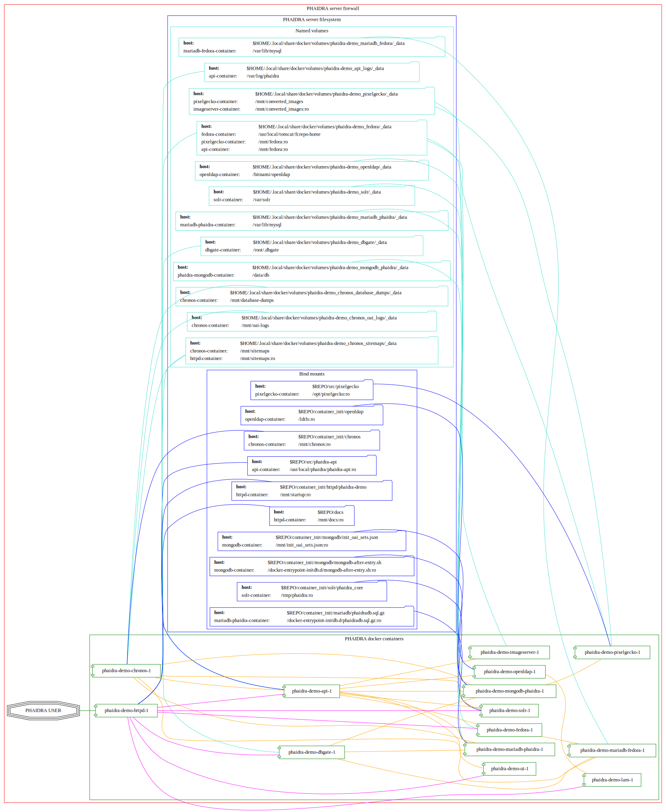
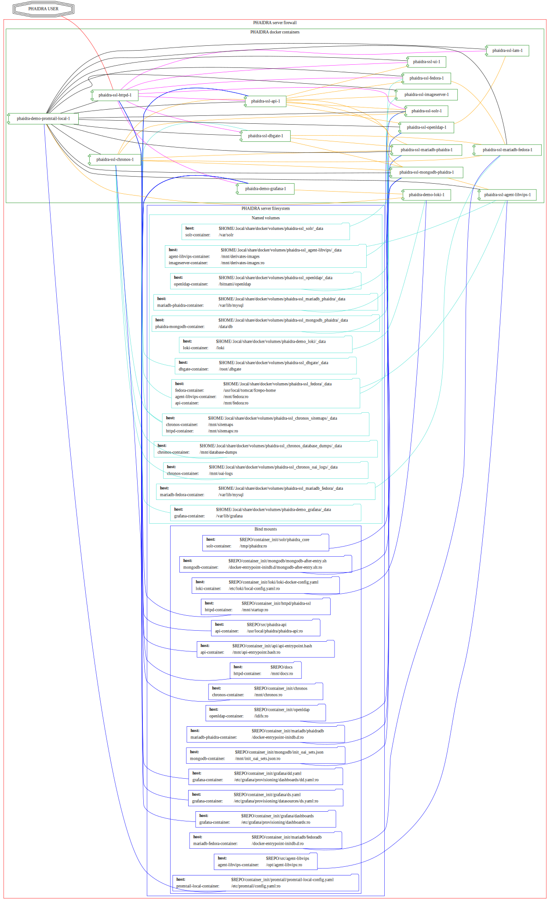
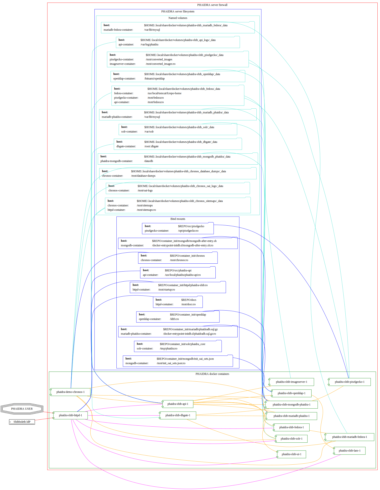

[[_TOC_]]

# About this repository

This repo hosts the source code and docker-compose files of the
[PHAIDRA](https://phaidra.org/) (Permanent Hosting, Archiving and
Indexing of Digital Resources and Assets) software, developed at the
[Vienna University Computer Center](https://zid.univie.ac.at/en/).

The aim of this project is to provide a high-quality, easy-to-set-up
web-based digital archiving system for academic institutions and other
organizations that need to provide a solution for long-term-archiving of
valuable data and metadata about the stored objects.

We provide various flavors for different use cases, from a demo version
running on a local desktop computer for evaluation, to an SSO-enabled
server version.

# Setup
For all versions you will need a recent [Docker
Installation](https://docs.docker.com/engine/install/), ideally on a
Linux distribution (PHAIDRA is mainly developed on Ubuntu and Debian).

Assuming you already have a running standard Docker installation you can either
continue that way, as it should not interfere with the code of this
repo.

However, we recommend using docker rootless to stay in sync with
this repo's documentation. There is extensive official [upstream
documentation](https://docs.docker.com/engine/security/rootless/) how to
do that.

See section [Docker Notes](#docker-notes) below to see what we do on a typical installation for running PHAIDRA on rootless containers.

# Run it

To start up PHAIDRA, change to one of the `compose_*` folders of this repository and run
`docker compose up -d`.  See sections below for version-specific prerequisites.

Here's a screenshot of what to expect:

---

---


## Demo Version

###  Demo specific prerequisites
None, just make sure no other service is using port 8899 on your
computer.

###  Demo Startup

After the following commands have finished, you will have a PHAIDRA
instance running on `http://localhost:8899`, that you can visit in
your browser.  See the screenshot below for what you can expect.

``` example
cd compose_demo
docker compose up -d
```

## SSL Version

###  SSL specific prerequisites

-   A DNS-entry for your computer's IP-address.
-   SSL-certificate and -key (put them into the
    `./encryption/webserver`-directory of this repo and name them
    `privkey.pem` and `fullchain.pem`).
-   firewall with port 80 and 443 open on your computer.
-   properly set variables in `./compose_ssl/.env`.

###  SSL Startup

Change to the folder `./compose_ssl` and run compose. After the
setup has finished you will PHAIDRA running on
`https://$YOUR-DNS-ENTRY`.

``` example
cd compose_ssl
docker compose up -d
```


## Shibboleth SSO Version

###  Shibboleth specific prerequisites

-   A DNS-entry for your computer's IP-address.
-   SSL-certificate and -key (put them into the
    `./encryption/webserver`-directory of this repo and name them
    `privkey.pem` and `fullchain.pem`).
-   firewall with port 80 and 443 open on your computer.
-   encryption and signing keys/certs for Shibboleth (plus the
    registration at your organization's IdP). You can create the
    required key/cert-pairs with the commands below (put the
    results into the `./encryption/shibboleth` folder of this repo).
-   properly set variables in `./compose_ssl/.env`.

``` example
openssl req -new -x509 -nodes -newkey rsa:2048 -keyout sp-encrypt-key.pem -days $DESIRED_VALIDITY_TIME -subj '/CN=$YOUR_FQDN' -out sp-encrypt-cert.pem
openssl req -new -x509 -nodes -newkey rsa:2048 -keyout sp-signing-key.pem -days $DESIRED_VALIDITY_TIME -subj '/CN=$YOUR_FQDN' -out sp-signing-cert.pem
```

###  Shibboleth Startup

Change to the folder `./compose_shib` and run compose. After the
setup has finished you will PHAIDRA running on
`https://$YOUR-DNS-ENTRY`.

``` example
cd compose_ssl
docker compose up -d
```

# Monitoring PHAIDRA's system usage

One can use the following command to real-time monitor the system usage
of PHAIDRA over all containers (here from an instance started from
`./compose_demo`):

``` example
docker stats<<<$(docker ps -q)
CONTAINER ID   NAME                             CPU %     MEM USAGE / LIMIT     MEM %     NET I/O           BLOCK I/O         PIDS
f80d2c7b7b54   phaidra-demo-httpd-1             0.01%     34.41MiB / 15.03GiB   0.22%     428kB / 415kB     73.7kB / 0B       109
edc5844fd0db   phaidra-demo-ui-1                0.00%     124.4MiB / 15.03GiB   0.81%     8.87kB / 234kB    0B / 0B           23
67d7d3fe22c4   phaidra-demo-pixelgecko-1        0.00%     51.5MiB / 15.03GiB    0.33%     1.71MB / 3.72MB   0B / 0B           1
769d93d91d9a   phaidra-demo-api-1               0.02%     167.9MiB / 15.03GiB   1.09%     1.64kB / 0B       4.58MB / 4.1kB    5
8e5e94391679   phaidra-demo-fedora-1            0.20%     710.3MiB / 15.03GiB   4.62%     35.6kB / 37.7kB   479kB / 31.1MB    56
abf37731a215   phaidra-demo-dbgate-1            0.00%     25.03MiB / 15.03GiB   0.16%     1.97kB / 224B     49.2kB / 4.1kB    12
7808741ab2a3   phaidra-demo-solr-1              0.72%     749.4MiB / 15.03GiB   4.87%     2.17kB / 0B       1.66MB / 160kB    54
0c4cc2324595   phaidra-demo-lam-1               0.01%     41MiB / 15.03GiB      0.27%     9.81kB / 165kB    0B / 0B           11
9f81141880f2   phaidra-demo-mariadb-fedora-1    0.02%     103.1MiB / 15.03GiB   0.67%     39.4kB / 34kB     26.4MB / 16.4kB   18
9de25b27810b   phaidra-demo-mariadb-phaidra-1   0.02%     241.3MiB / 15.03GiB   1.57%     1.9kB / 0B        15.8MB / 8.19kB   8
76039224bd68   phaidra-demo-mongodb-phaidra-1   0.49%     211.4MiB / 15.03GiB   1.37%     3.72MB / 1.71MB   1.66MB / 29.1MB   31
264601b89504   phaidra-demo-imageserver-1       0.00%     25.7MiB / 15.03GiB    0.17%     2.17kB / 0B       0B / 0B           57
9d8afe7f588a   phaidra-demo-openldap-1          0.00%     15.45MiB / 15.03GiB   0.10%     2.17kB / 0B       627kB / 4.1kB     2
```

# new folders on your system after startup

`docker compose up -d` will create directories in
`$HOME/.local/share/docker/volumes` to store data created by PHAIDRA
over system shutdowns, etc. After startup it should look like this:

``` example
daniel@pcherzigd64:~/gitlab.phaidra.org/phaidra-dev/phaidra-docker$ docker volume ls --filter label=com.docker.compose.project=phaidra
DRIVER    VOLUME NAME
local     phaidra_api_logs
local     phaidra_dbgate
local     phaidra_fedora
local     phaidra_mariadb_fedora
local     phaidra_mariadb_phaidra
local     phaidra_mongodb_phaidra
local     phaidra_openldap
local     phaidra_pixelgecko
local     phaidra_solr
## sample volume inspection
daniel@pcherzigd64:~/gitlab.phaidra.org/phaidra-dev/phaidra-docker$ docker volume inspect phaidra_api_logs 
[
    {
        "CreatedAt": "2023-07-07T14:02:51+02:00",
        "Driver": "local",
        "Labels": {
            "com.docker.compose.project": "phaidra",
            "com.docker.compose.version": "2.18.1",
            "com.docker.compose.volume": "api_logs"
        },
        "Mountpoint": "/home/daniel/.local/share/docker/volumes/phaidra_api_logs/_data",
        "Name": "phaidra_api_logs",
        "Options": null,
        "Scope": "local"
    }
]
## listing the directories the 'standard way'
daniel@pcherzigd64:~/gitlab.phaidra.org/phaidra-dev/phaidra-docker$ ls -lha ~/.local/share/docker/volumes/phaidra*
/home/daniel/.local/share/docker/volumes/phaidra_api_logs:
total 88K
drwx-----x   3 daniel daniel 4.0K Jul  7 14:02 .
drwx-----x 710 daniel daniel  76K Jul  7 14:05 ..
drwxr-xr-x   2 daniel daniel 4.0K Jul  7 14:06 _data

/home/daniel/.local/share/docker/volumes/phaidra_dbgate:
total 88K
drwx-----x   3 daniel daniel 4.0K Jul  7 14:02 .
drwx-----x 710 daniel daniel  76K Jul  7 14:05 ..
drwxr-xr-x   5 daniel daniel 4.0K Jul  7 14:02 _data

/home/daniel/.local/share/docker/volumes/phaidra_fedora:
total 88K
drwx-----x   3 daniel daniel 4.0K Jul  7 14:02 .
drwx-----x 710 daniel daniel  76K Jul  7 14:05 ..
drwxr-xr-x   3 daniel daniel 4.0K Jul  7 14:03 _data

/home/daniel/.local/share/docker/volumes/phaidra_mariadb_fedora:
total 88K
drwx-----x   3 daniel daniel 4.0K Jul  7 14:02 .
drwx-----x 710 daniel daniel  76K Jul  7 14:05 ..
drwxr-xr-x   5 100998 100998 4.0K Jul  7 14:06 _data

/home/daniel/.local/share/docker/volumes/phaidra_mariadb_phaidra:
total 88K
drwx-----x   3 daniel daniel 4.0K Jul  7 14:02 .
drwx-----x 710 daniel daniel  76K Jul  7 14:05 ..
drwxr-xr-x   6 100998 100998 4.0K Jul  7 14:06 _data

/home/daniel/.local/share/docker/volumes/phaidra_mongodb_phaidra:
total 88K
drwx-----x   3 daniel daniel 4.0K Jul  7 14:02 .
drwx-----x 710 daniel daniel  76K Jul  7 14:05 ..
drwxr-xr-x   4 100998 100998 4.0K Jul  7 14:06 _data

/home/daniel/.local/share/docker/volumes/phaidra_openldap:
total 88K
drwx-----x   3 daniel daniel 4.0K Jul  7 14:02 .
drwx-----x 710 daniel daniel  76K Jul  7 14:05 ..
drwxr-xr-x   4 daniel daniel 4.0K Jul  7 14:02 _data

/home/daniel/.local/share/docker/volumes/phaidra_pixelgecko:
total 88K
drwx-----x   3 daniel daniel 4.0K Jul  7 14:02 .
drwx-----x 710 daniel daniel  76K Jul  7 14:05 ..
drwxr-xr-x   2 daniel daniel 4.0K Jul  7 14:02 _data

/home/daniel/.local/share/docker/volumes/phaidra_solr:
total 88K
drwx-----x   3 daniel daniel 4.0K Jul  7 14:02 .
drwx-----x 710 daniel daniel  76K Jul  7 14:05 ..
drwxrwx---   4 108982 daniel 4.0K Jul  7 14:02 _data
## check volume sizes
daniel@pcherzigd64:~/gitlab.phaidra.org/phaidra-dev/phaidra-docker$ sudo du -sh ~/.local/share/docker/volumes/phaidra_*
[sudo] password for daniel: 
16K    /home/daniel/.local/share/docker/volumes/phaidra_api_logs
32K    /home/daniel/.local/share/docker/volumes/phaidra_dbgate
320K   /home/daniel/.local/share/docker/volumes/phaidra_fedora
138M   /home/daniel/.local/share/docker/volumes/phaidra_mariadb_fedora
174M   /home/daniel/.local/share/docker/volumes/phaidra_mariadb_phaidra
301M   /home/daniel/.local/share/docker/volumes/phaidra_mongodb_phaidra
212K   /home/daniel/.local/share/docker/volumes/phaidra_openldap
8.0K   /home/daniel/.local/share/docker/volumes/phaidra_pixelgecko
440K   /home/daniel/.local/share/docker/volumes/phaidra_solr
```

You might notice that inspecting the actual sizes of the directories
requires `sudo` – this is due to the fact that solr, mariadb, and
mongodb volumes make use of a separate user from within the container.
The UIDs all come from the range your user is allowed to assign to using
the `newuidmap` and `newgidmap` programs deriving from the `uidmap`
package mentioned under system requirements. One can see this as a
reminder to be careful when manipulating this kind of data (at least the
databases can be manipulated from <http://localhost:8899/dbgate> without
special permissions).

# Complete cleanup

MATTER OF CHANGE. During development things can become very cluttered. A
pretty complete cleanup (at the cost of an image rebuild) can be
achieved by running the following commands:

``` example
# shut down and remove running containers (from the repo directory)
docker compose down

# remove persisted data from previous runs (from anywhere)
docker volume rm $(docker volume ls --filter label=com.docker.compose.project=phaidra --quiet)

# cleanup docker matter (build caches, images..., from anywhere)
docker system prune --all
```

# Phaidra Components

In the folder `./components` one will find `phaidra-api`, `phaidra-ui`,
and `phaidra-vue-components`. These are copies of the public github
repos, adapted for use in the docker context here. See the notes in the
following subsections.

## phaidra-api

This is a checkout of commit c880c4159c5d68b25426451f4822f744a53ef680 of
the repo at <https://github.com/phaidra/phaidra-api> with symlinks and
git history stripped:

``` example
daniel@pcherzigd64:~/gitlab.phaidra.org/phaidra-dev/phaidra-docker/components/phaidra-api$ git log -n1
commit c880c4159c5d68b25426451f4822f744a53ef680 (HEAD -> master, origin/master)
Author: Rasta <hudak.rastislav@gmail.com>
Date:   Mon May 22 16:08:59 2023 +0200

    avoiding empty eq
daniel@pcherzigd64:~/gitlab.phaidra.org/phaidra-dev/phaidra-docker/components/phaidra-api$ find . -type l
./public/xsd/uwmetadata
./log4perl.conf
daniel@pcherzigd64:~/gitlab.phaidra.org/phaidra-dev/phaidra-docker/components/phaidra-api$ find . -type l -exec rm -v {} \;
removed './public/xsd/uwmetadata'
removed './log4perl.conf'
daniel@pcherzigd64:~/gitlab.phaidra.org/phaidra-dev/phaidra-docker/components/phaidra-api$ rm -v .gitignore && rm -rv .git
removed '.gitignore'
removed directory '.git/refs/tags'
removed '.git/refs/heads/master'
removed directory '.git/refs/heads'
removed directory '.git/refs/remotes'
removed directory '.git/refs'
removed '.git/info/exclude'
removed directory '.git/info'
removed '.git/HEAD'
removed '.git/index'
removed '.git/hooks/applypatch-msg.sample'
removed '.git/hooks/pre-commit.sample'
removed '.git/hooks/push-to-checkout.sample'
removed '.git/hooks/post-update.sample'
removed '.git/hooks/pre-merge-commit.sample'
removed '.git/hooks/update.sample'
removed '.git/hooks/commit-msg.sample'
removed '.git/hooks/pre-push.sample'
removed '.git/hooks/pre-applypatch.sample'
removed '.git/hooks/pre-rebase.sample'
removed '.git/hooks/pre-receive.sample'
removed '.git/hooks/fsmonitor-watchman.sample'
removed '.git/hooks/prepare-commit-msg.sample'
removed directory '.git/hooks'
removed '.git/config'
rm: remove write-protected regular file '.git/objects/pack/pack-7e94ef195971c977ba26038f46db4d3026adbcc7.pack'? yes
removed '.git/objects/pack/pack-7e94ef195971c977ba26038f46db4d3026adbcc7.pack'
rm: remove write-protected regular file '.git/objects/pack/pack-7e94ef195971c977ba26038f46db4d3026adbcc7.idx'? yes
removed '.git/objects/pack/pack-7e94ef195971c977ba26038f46db4d3026adbcc7.idx'
removed directory '.git/objects/pack'
removed directory '.git/objects/info'
removed directory '.git/objects'
removed directory '.git/branches'
removed '.git/logs/refs/heads/master'
removed directory '.git/logs/refs/heads'
removed directory '.git/logs/refs/remotes'
removed directory '.git/logs/refs'
removed '.git/logs/HEAD'
removed directory '.git/logs'
removed '.git/packed-refs'
removed '.git/description'
removed directory '.git'
```

## phaidra-ui

This is a checkout of commit 5c9455373d36f4756e9caa2af989fac4dbd28f9f of
the repo at <https://github.com/phaidra/phaidra-ui> with symlinks and
git history stripped:

``` example
daniel@pcherzigd64:~/gitlab.phaidra.org/phaidra-dev/phaidra-docker/components/phaidra-ui$ git log -n1
commit 5c9455373d36f4756e9caa2af989fac4dbd28f9f (HEAD -> master, origin/master)
Merge: 63d4278 eca211f
Author: Phaidra Devel (phaidra2) <phaidra.devel@univie.ac.at>
Date:   Tue May 9 14:21:44 2023 +0200

    Merge branch 'master' of github.com:phaidra/phaidra-ui
daniel@pcherzigd64:~/gitlab.phaidra.org/phaidra-dev/phaidra-docker/components/phaidra-ui$ find . -type l -exec rm -v {} \;
removed './config/phaidra-ui.js'
daniel@pcherzigd64:~/gitlab.phaidra.org/phaidra-dev/phaidra-docker/components/phaidra-ui$ rm .gitignore 
daniel@pcherzigd64:~/gitlab.phaidra.org/phaidra-dev/phaidra-docker/components/phaidra-ui$ rm -rfv .git
removed directory '.git/refs/tags'
removed '.git/refs/heads/master'
removed directory '.git/refs/heads'
removed directory '.git/refs/remotes'
removed directory '.git/refs'
removed '.git/info/exclude'
removed directory '.git/info'
removed '.git/HEAD'
removed '.git/index'
removed '.git/hooks/applypatch-msg.sample'
removed '.git/hooks/pre-commit.sample'
removed '.git/hooks/push-to-checkout.sample'
removed '.git/hooks/post-update.sample'
removed '.git/hooks/pre-merge-commit.sample'
removed '.git/hooks/update.sample'
removed '.git/hooks/commit-msg.sample'
removed '.git/hooks/pre-push.sample'
removed '.git/hooks/pre-applypatch.sample'
removed '.git/hooks/pre-rebase.sample'
removed '.git/hooks/pre-receive.sample'
removed '.git/hooks/fsmonitor-watchman.sample'
removed '.git/hooks/prepare-commit-msg.sample'
removed directory '.git/hooks'
removed '.git/config'
removed '.git/objects/pack/pack-996b081fad6c6ca2800c42b1c291f1905f007de0.idx'
removed '.git/objects/pack/pack-996b081fad6c6ca2800c42b1c291f1905f007de0.pack'
removed directory '.git/objects/pack'
removed directory '.git/objects/info'
removed directory '.git/objects'
removed directory '.git/branches'
removed '.git/logs/refs/heads/master'
removed directory '.git/logs/refs/heads'
removed directory '.git/logs/refs/remotes'
removed directory '.git/logs/refs'
removed '.git/logs/HEAD'
removed directory '.git/logs'
removed '.git/packed-refs'
removed '.git/description'
removed directory '.git'
```

## phaidra-vue-components

This is a checkout of commit 64f8b9870a0bc66a6b4a58fec5dfe6c2431e72d7 of
the repo at <https://github.com/phaidra/phaidra-vue-components.git> with
git history stripped:

``` example
daniel@pcherzigd64:~/gitlab.phaidra.org/phaidra-dev/phaidra-docker/components/phaidra-vue-components$ git log -n1
commit 64f8b9870a0bc66a6b4a58fec5dfe6c2431e72d7 (HEAD -> master, origin/master)
Author: rasta <hudak.rastislav@gmail.com>
Date:   Tue May 23 12:21:06 2023 +0200

    Update vocabulary.js
daniel@pcherzigd64:~/gitlab.phaidra.org/phaidra-dev/phaidra-docker/components/phaidra-vue-components$ find . -type l -exec rm -v {} \;
daniel@pcherzigd64:~/gitlab.phaidra.org/phaidra-dev/phaidra-docker/components/phaidra-vue-components$ rm -v .gitignore 
removed '.gitignore'
daniel@pcherzigd64:~/gitlab.phaidra.org/phaidra-dev/phaidra-docker/components/phaidra-vue-components$ rm -rfv .git
removed directory '.git/refs/tags'
removed '.git/refs/heads/master'
removed directory '.git/refs/heads'
removed directory '.git/refs/remotes'
removed directory '.git/refs'
removed '.git/info/exclude'
removed directory '.git/info'
removed '.git/HEAD'
removed '.git/index'
removed '.git/hooks/applypatch-msg.sample'
removed '.git/hooks/pre-commit.sample'
removed '.git/hooks/push-to-checkout.sample'
removed '.git/hooks/post-update.sample'
removed '.git/hooks/pre-merge-commit.sample'
removed '.git/hooks/update.sample'
removed '.git/hooks/commit-msg.sample'
removed '.git/hooks/pre-push.sample'
removed '.git/hooks/pre-applypatch.sample'
removed '.git/hooks/pre-rebase.sample'
removed '.git/hooks/pre-receive.sample'
removed '.git/hooks/fsmonitor-watchman.sample'
removed '.git/hooks/prepare-commit-msg.sample'
removed directory '.git/hooks'
removed '.git/config'
removed '.git/objects/pack/pack-320ae928aaa1c2aa92b1253da03d7a2ae4802ea1.idx'
removed '.git/objects/pack/pack-320ae928aaa1c2aa92b1253da03d7a2ae4802ea1.pack'
removed directory '.git/objects/pack'
removed directory '.git/objects/info'
removed directory '.git/objects'
removed directory '.git/branches'
removed '.git/logs/refs/heads/master'
removed directory '.git/logs/refs/heads'
removed directory '.git/logs/refs/remotes'
removed directory '.git/logs/refs'
removed '.git/logs/HEAD'
removed directory '.git/logs'
removed '.git/packed-refs'
removed '.git/description'
removed directory '.git'
```

## pixelgecko

This is a checkout from
<https://gitlab.phaidra.org/phaidra-dev/pixelgecko> at commit
be0af173eaac297289fa51843b69327f7c95242c with git components stripped.

``` example
daniel@pcherzigd64:~/gitlab.phaidra.org/phaidra-dev/phaidra-docker/components$ git clone git@gitlab.phaidra.org:phaidra-dev/pixelgecko.git
Cloning into 'pixelgecko'...
remote: Enumerating objects: 131, done.
remote: Counting objects: 100% (85/85), done.
remote: Compressing objects: 100% (50/50), done.
remote: Total 131 (delta 32), reused 85 (delta 32), pack-reused 46
Receiving objects: 100% (131/131), 74.98 KiB | 18.75 MiB/s, done.
Resolving deltas: 100% (52/52), done.
daniel@pcherzigd64:~/gitlab.phaidra.org/phaidra-dev/phaidra-docker/components$ cd pixelgecko/
daniel@pcherzigd64:~/gitlab.phaidra.org/phaidra-dev/phaidra-docker/components/pixelgecko$ git log -n1
commit be0af173eaac297289fa51843b69327f7c95242c (HEAD -> master, origin/master, origin/HEAD)
Author: Daniel Herzig <daniel.herzig@univie.ac.at>
Date:   Wed Feb 1 14:10:40 2023 +0100

    indent properly
daniel@pcherzigd64:~/gitlab.phaidra.org/phaidra-dev/phaidra-docker/components/pixelgecko$ find . -type l
daniel@pcherzigd64:~/gitlab.phaidra.org/phaidra-dev/phaidra-docker/components/pixelgecko$ rm -rf .git .gitignore
```


# Technical Notes
## Directory structure of this repository

``` example
.
├── components
│   ├── phaidra-api
│   ├── phaidra-ui
│   ├── phaidra-vue-components
│   └── pixelgecko
├── compose_demo
├── compose_shib
├── compose_ssl
├── container_components
│   ├── mariadb
│   └── openldap
├── dockerfiles
├── encryption
│   ├── shibboleth
│   └── webserver
├── image_components
│   ├── pixelgecko
│   └── solr
├── pictures
├── shibboleth
└── webserver_configs

22 directories
```

##  Demo Technical sketch
System when running `docker compose up -d` from directory
`./compose_demo` (Phaidra available on `http://localhost:8899`.).



##  SSL Technical sketch
System when running `docker compose up -d` from directory
`./compose_ssl` (Phaidra available on `https://$YOUR_FQDN`, see
section 'System startup' below for prerequisites).



##  Shibboleth Technical sketch
System when running `docker compose up -d` from directory
`./compose_shib` (Phaidra available on `http://localhost:8899`.).



## Software in use

[PHAIDRA](https://phaidra.org/) is based on the shoulders of the
following great pieces of software (in alphabetical order):

-   [Apache HTTP server](https://httpd.apache.org/)
-   [Apache Solr](https://solr.apache.org/)
-   [DbGate](https://dbgate.org/)
-   [Debian](https://www.debian.org/)
-   [Docker](https://www.docker.com/)
-   [LDAP Account Manager](https://www.ldap-account-manager.org/lamcms/)
-   [Lyrasis Fedora](https://fedora.lyrasis.org/)
-   [MariaDB](https://mariadb.org/)
-   [MongoDB](https://www.mongodb.com/)
-   [OpenLDAP](https://www.openldap.org/)
-   [Perl](https://www.perl.org/)
-   [Shibboleth](https://www.shibboleth.net/)
-   [Ubuntu](https://ubuntu.com/)
-   [Vue.js](https://vuejs.org/)


## Docker Notes
Below you see what we use at the time of writing (Fri Sep 15 01:18:31 PM
CEST 2023):

``` bash
docker version
```

``` example
Client: Docker Engine - Community
 Version:           24.0.6
 API version:       1.43
 Go version:        go1.20.7
 Git commit:        ed223bc
 Built:             Mon Sep  4 12:32:16 2023
 OS/Arch:           linux/amd64
 Context:           rootless

Server: Docker Engine - Community
 Engine:
  Version:          24.0.6
  API version:      1.43 (minimum version 1.12)
  Go version:       go1.20.7
  Git commit:       1a79695
  Built:            Mon Sep  4 12:32:16 2023
  OS/Arch:          linux/amd64
  Experimental:     false
 containerd:
  Version:          1.6.22
  GitCommit:        8165feabfdfe38c65b599c4993d227328c231fca
 runc:
  Version:          1.1.8
  GitCommit:        v1.1.8-0-g82f18fe
 docker-init:
  Version:          0.19.0
  GitCommit:        de40ad0
 rootlesskit:
  Version:          1.1.1
  ApiVersion:       1.1.1
  NetworkDriver:    slirp4netns
  PortDriver:       slirp4netns
  StateDir:         /tmp/rootlesskit1559358571
 slirp4netns:
  Version:          1.2.0
  GitCommit:        656041d45cfca7a4176f6b7eed9e4fe6c11e8383
```

``` bash
docker info
```

``` example
Client: Docker Engine - Community
 Version:    24.0.6
 Context:    rootless
 Debug Mode: false
 Plugins:
  buildx: Docker Buildx (Docker Inc.)
    Version:  v0.11.2
    Path:     /usr/libexec/docker/cli-plugins/docker-buildx
  compose: Docker Compose (Docker Inc.)
    Version:  v2.21.0
    Path:     /usr/libexec/docker/cli-plugins/docker-compose

Server:
 Containers: 14
  Running: 13
  Paused: 0
  Stopped: 1
 Images: 20
 Server Version: 24.0.6
 Storage Driver: fuse-overlayfs
 Logging Driver: json-file
 Cgroup Driver: systemd
 Cgroup Version: 2
 Plugins:
  Volume: local
  Network: bridge host ipvlan macvlan null overlay
  Log: awslogs fluentd gcplogs gelf journald json-file local logentries splunk syslog
 Swarm: inactive
 Runtimes: io.containerd.runc.v2 runc
 Default Runtime: runc
 Init Binary: docker-init
 containerd version: 8165feabfdfe38c65b599c4993d227328c231fca
 runc version: v1.1.8-0-g82f18fe
 init version: de40ad0
 Security Options:
  seccomp
   Profile: builtin
  rootless
  cgroupns
 Kernel Version: 6.1.0-12-amd64
 Operating System: Debian GNU/Linux 12 (bookworm)
 OSType: linux
 Architecture: x86_64
 CPUs: 8
 Total Memory: 15.03GiB
 Name: pcherzigd64
 ID: 4d080886-f0a3-4478-bac7-ebadf0ccfd68
 Docker Root Dir: /home/daniel/.local/share/docker
 Debug Mode: false
 Experimental: false
 Insecure Registries:
  127.0.0.0/8
 Live Restore Enabled: false

```

As one can see above, we are using Docker's rootlesskit, to avoid
uneccessary privileges for the dockerized components. This also means,
that the user starting up the program does not need root/admin
privileges on the machine running PHAIDRA.

Nevertheless, setting up Docker itself will need a system admin user.
Below we describe the steps that we use for rootless Docker with
priviledged ports and (needed for http and https traffic on the
SSL-enabled versions) and client-IP forwarding (needed for restricting
access to parts of the system).

### set up rootlesskit

1.  turn off running priviledged docker service

``` example
sudo systemctl disable --now docker.service docker.socket
sudo reboot
```

2.  install uidmap package

    The `uidmap` package is available in both ubuntu and Debian official
    repositories and is needed for Docker's rootlesskit to properly
    function.

``` example
sudo apt install uidmap
```

3.  install rootlesskit

``` example
dockerd-rootless-setuptool.sh
# activate autostart of services
sudo loginctl enable-linger $USER
echo "export DOCKER_HOST=unix:///run/user/$(id -u)/docker.sock" >> ~/.bashrc
# needed at least on headless ubuntu systems
echo "export XDG_RUNTIME_DIR=/run/user/$(id -u)" >> ~/.bashrc
```

4.  change port-forwarding mode for rootlesskit to slirp4netns

    In order to receive the original client IPs accessing the webserver,
    we change the port-forwarding mode of the rootlesskit (the default
    one drops IPs and nginx/apache only receive the docker
    network-bridge address, which does not allow for IP-filtering
    administrative parts of the system as a consequence).

``` example
mkdir ~/.config/systemd/user/docker.service.d
echo "[Service]" >> ~/.config/systemd/user/docker.service.d/override.conf
echo 'Environment="DOCKERD_ROOTLESS_ROOTLESSKIT_PORT_DRIVER=slirp4netns"' >> ~/.config/systemd/user/docker.service.d/override.conf
systemctl --user daemon-reload
systemctl --user restart docker
```

5.  allow priviledged ports for slirp4netns

    To allow opening ports 80 and 443 for unpriviledged slirp4netns we
    need to dedicately allow it (setcap will not work for this):

``` example
echo "net.ipv4.ip_unprivileged_port_start=0" | sudo tee /etc/sysctl.d/99-rootless.conf
sudo sysctl --system
```

6.  add cpuset support

    By default docker cpuset limitations are not enabled for rootless
    configurations. One can do the following to change this. (see:
    <https://docs.docker.com/engine/security/rootless/#limiting-resources>)

``` example
cat /sys/fs/cgroup/user.slice/user-$(id -u).slice/user@$(id -u).service/cgroup.controllers
cpu memory pids
sudo su -
mkdir -p /etc/systemd/system/user@.service.d
cat > /etc/systemd/system/user@.service.d/delegate.conf << EOF
> [Service]
> Delegate=cpu cpuset io memory pids
> EOF
systemctl daemon-reload
exit
cat /sys/fs/cgroup/user.slice/user-$(id -u).slice/user@$(id -u).service/cgroup.controllers
cpuset cpu io memory pids
systemctl --user restart docker
```

