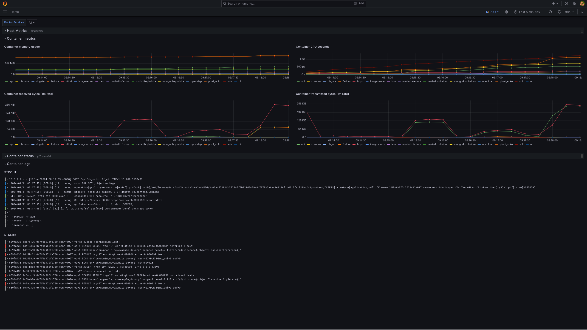
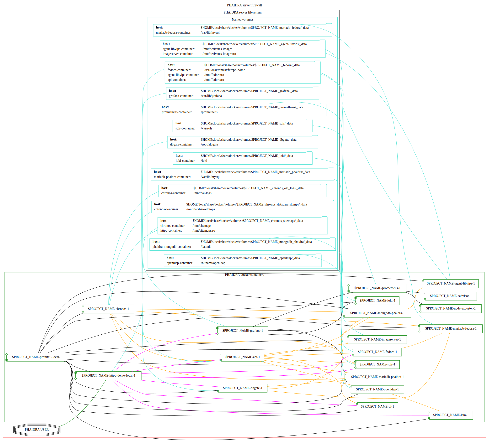
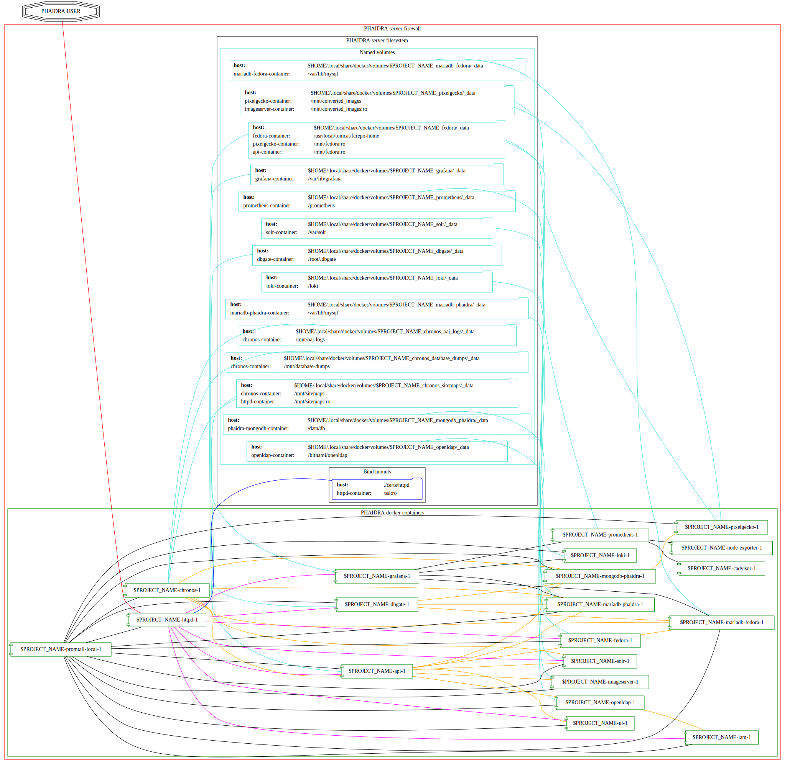
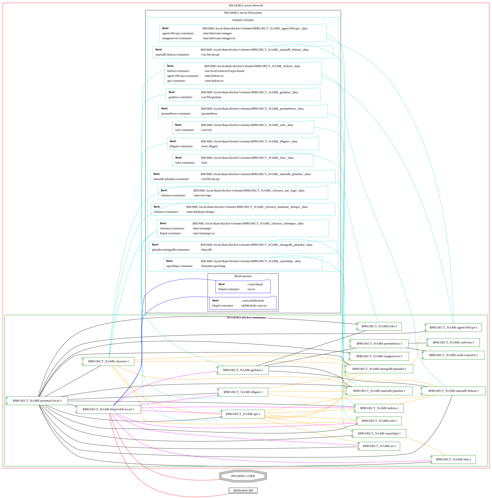

[](CODE_OF_CONDUCT.md)
___
*Running PHAIDRA website*
___

# About this repository

This repo hosts the source code and the docker-compose startup file of the
[PHAIDRA](https://phaidra.org/) (Permanent Hosting, Archiving and
Indexing of Digital Resources and Assets) software, developed at the
[Vienna University Computer Center](https://zid.univie.ac.at/en/).

The aim of this project is to provide a high-quality, easy-to-set-up
web-based digital archiving system for academic institutions and other
organizations that need to provide a solution for long-term-archiving of
valuable data and metadata about the stored objects.

We provide various flavors for different use cases, from a demo version
running on a local desktop computer for evaluation, to an shibboleth-enabled
server version.

# Setup
For all versions you will need a recent [Docker
Installation](https://docs.docker.com/engine/install/), ideally on a
Linux distribution (PHAIDRA is mainly developed on Ubuntu and Debian).

Assuming you already have a running standard Docker installation you can either
continue that way, as it should not interfere with the code of this
repo.

However, we recommend using docker rootless to stay in sync with
this repo's documentation. There is extensive official [upstream
documentation](https://docs.docker.com/engine/security/rootless/) how to
do that.

See section [Docker Notes](#docker-notes) below to see what we do on a typical installation for running PHAIDRA on rootless containers.

# Docker compose profiles

We are using docker profiles to start up the relevant containers for the desired use case.

We highly recommend to use the `--project-name $PROJECT_NAME_OF_YOUR_LIKING` flag to the `docker compose` command, as this will allow you to easily identify the persistant docker volumes which will be created to store your valuable data.

## Profiles using versioned images including all code

+ `demo-local`: for an evaluation installation, serving PHAIDRA on `http://localhost:8899`. Uses only local storage.
+ `demo-s3`: for an evaluation installation, serving PHAIDRA on `http://localhost:8899`. Uses an S3-bucket for the object repository and images converted to the format supported by IIPImage.
+ `ssl-local`: for broadcasting/production use, serving PHAIDRA on `https://$YOURDOMAIN`. Uses only local storage.
+ `ssl-s3`: for broadcasting/production use, serving PHAIDRA on `https://$YOURDOMAIN`. Uses an S3-bucket for the object repository and images converted to the format supported by IIPImage.
+ `shib-local`: for broadcasting/production use, serving PHAIDRA on `https://$YOURDOMAIN`. Uses only local storage.  Uses an external shibboleth-idp for authentication.
+ `shib-s3`: for broadcasting/production use, serving PHAIDRA on `https://$YOURDOMAIN`. Uses an S3-bucket for the object repository and images converted to the format supported by IIPImage.  Uses an external shibboleth-idp for authentication.

## Profiles bindmounting the repository's code

+ `demo-local-dev`: see above.
+ `demo-s3-dev`: see above.
+ `ssl-local-dev`: see above.
+ `ssl-s3-dev`: see above.
+ `shib-local-dev`: see above.
+ `shib-s3-dev`: see above.

Additionally to the bind mounted code, the ui components phaidra-ui and phaidra-vue-components directories will be watched and the Nuxt app will be started in hotreload. Changes to the source code should the be recompiled and applied on save. To start the container in watch mode you can use the --watch parameter.

Note: Running the Nuxt application in hotreload requires a lot of memory and can occasionally lead to a crash when it reaches the heap limit.

# Run it
All default values assume that you are running docker rootless as the first non-root user with uid 1000 on your linux computer.  This is what we strongly recommend.  However, if this does not match your reality, please check the following options:
## Linux user on docker rootless, but not uid 1000
+ Please set the variable `HOST_DOCKER_SOCKET` to `/run/user/$YOUR-UID/docker.sock` in an `.env` file.  You can get your uid quickly by running `id -u`.
## Users running priviledged ('normal') docker (Linux and Windows Docker based on wsl2)
+ Please set the variable `ADMIN_IP_LIST` to `172.29.5.1` in an `.env` file for the demo/localhost version. This is to reach the admin area. For ssl/shib see below.
+ Please set the variable `HOST_DOCKER_SOCKET` to `/var/run/docker.sock` in an `.env` file. This is to get proper service monitoring.
## Users running priviledged ('normal') docker (OSX)
+ Please set the variable `ADMIN_IP_LIST` to `192.168.65.1` in an `.env` file for the demo/localhost version. This is to reach the admin area. For ssl/shib see below.
+ Please set the variable `HOST_DOCKER_SOCKET` to `/var/run/docker.sock` in an `.env` file. This is to get proper service monitoring.

## Demo version with local storage
###  Prerequisites
+ make sure no other service is using port 8899 on your computer.
+ set the following variables in your `.env` file:
  + `PHAIDRA_ADMIN_EMAIL`
  + `MD_CERTIFICATE_AGREEMENT`

### Startup
Run the following command to get PHAIDRA running on `http://localhost:8899`:

```
docker compose --project-name $PROJECT_NAME_OF_YOUR_LIKING --profile demo-local up -d
```

## Demo version with S3 storage
### Prerequisites
+ make sure no other service is using port 8899 on your computer.
+ set the following variables in your `.env` file:
  + `S3_ACCESS_KEY`
  + `S3_SECRET_KEY`
  + `S3_BUCKETNAME`
  + `S3_CACHESIZE`: in Bytes, defaults to 100000000 (100MB).
  + `S3_REGION`
  + `S3_ENDPOINT`: e.g. `https://s3.amazonaws.com` or `https://s3.mydomain.com:1234`. Defaults to `http://minio:9000` (the local minio s3 instance of --profile minio-s3-dev)
  + `PHAIDRA_ADMIN_EMAIL`
  + `MD_CERTIFICATE_AGREEMENT`

### Startup
Run the following command to get PHAIDRA running on `http://localhost:8899`:

```
docker compose --project-name $PROJECT_NAME_OF_YOUR_LIKING --profile demo-s3 up -d
```

## SSL version with local storage
###  Prerequisites
+ make sure no other service is using ports 80 and 443 on your computer.
+ a DNS-entry pointing to your computer's IP-address.
+ SSL-certificate and -key (put them into the `certs/httpd` and name them `privkey.pem` and `fullchain.pem` -- **make sure your user has read access on these files**).  Certificates acquired from the [certbot tool](https://certbot.eff.org/) should do the job as they contain the full chain of certificates.
+ firewall with port 80 and 443 open on your computer.
+ set the following variables in your `.env` file:
  + `ADMIN_IP_LIST`: List of space-delimited IP addresses that should be allowed to reach the admin area. This includes the static IP address of your computer, if you access the installation through your local browser. If you access your installation from localhost by modifying `/etc/hosts` you will want to keep the gateway address in there as well (10.0.2.2 [default] for rootless docker on Linux, 172.29.5.1 for priviledged docker on Linux or Windows,  192.168.65.1 for priviledged docker on OSX).
  + `OUTSIDE_HTTP_SCHEME="https"`
  + `PHAIDRA_HOSTPORT=""`
  + `PHAIDRA_PORTSTUB=""`
  + `PHAIDRA_HOSTNAME="$YOUR-FQDN"`
  + `PHAIDRA_ADMIN_EMAIL`
  + `MD_CERTIFICATE_AGREEMENT`

###  Startup
Run the following command to get PHAIDRA running on `https://$YOUR-FQDN`:

```
docker compose --project-name $PROJECT_NAME_OF_YOUR_LIKING --profile ssl-local up -d
```

## SSL version with S3 storage
###  Prerequisites
+ make sure no other service is using ports 80 and 443 on your computer.
+ a DNS-entry pointing to your computer's IP-address.
+ SSL-certificate and -key (put them into the `certs/httpd` and name them `privkey.pem` and `fullchain.pem` -- **make sure your user has read access on these files**).  Certificates acquired from the [certbot tool](https://certbot.eff.org/) should do the job as they contain the full chain of certificates.
+ firewall with port 80 and 443 open on your computer.
+ set the following variables in your `.env` file:
  + `ADMIN_IP_LIST`: List of space-delimited IP addresses that should be allowed to reach the admin area. This includes the static IP address of your computer, if you access the installation through your local browser. If you access your installation from localhost by modifying `/etc/hosts` you will want to keep the gateway address in there as well (10.0.2.2 [default] for rootless docker on Linux, 172.29.5.1 for priviledged docker on Linux or Windows,  192.168.65.1 for priviledged docker on OSX).
  + `OUTSIDE_HTTP_SCHEME="https"`
  + `PHAIDRA_HOSTPORT=""`
  + `PHAIDRA_PORTSTUB=""`
  + `PHAIDRA_HOSTNAME="$YOUR-FQDN"`
  + `S3_ACCESS_KEY`
  + `S3_SECRET_KEY`
  + `S3_BUCKETNAME`
  + `S3_CACHESIZE`: in Bytes, defaults to 100000000 (100MB).
  + `S3_REGION`
  + `PHAIDRA_ADMIN_EMAIL`
  + `MD_CERTIFICATE_AGREEMENT`

###  Startup
Run the following command to get PHAIDRA running on `https://$YOUR-FQDN`:

```
docker compose --project-name $PROJECT_NAME_OF_YOUR_LIKING --profile ssl-s3 up -d
```

## Shibboleth version with local storage
NOTE: This profile is not as straight forward, as the built-in apache2 webserver will act as a Shibboleth-SP, which requires registration at your organization's Shibboleth IDP.  It's very likely that you need to modify a row of variables, depending on your organization.
###  Prerequisites
+ make sure no other service is using ports 80 and 443 on your computer.
+ a DNS-entry pointing to your computer's IP-address.
+ SSL-certificate and -key (put them into the `certs/httpd` and name them `privkey.pem` and `fullchain.pem` -- **make sure your user has read access on these files**).  Certificates acquired from the [certbot tool](https://certbot.eff.org/) should do the job as they contain the full chain of certificates.
+ generate certificates for communication with your idp by running the commands below and put them into `certs/shibboleth`:
```
openssl req -new -x509 -nodes -newkey rsa:2048 -keyout sp-encrypt-key.pem -days $DESIRED_VALIDITY_TIME -subj '/CN=$YOUR_FQDN' -out sp-encrypt-cert.pem
openssl req -new -x509 -nodes -newkey rsa:2048 -keyout sp-signing-key.pem -days $DESIRED_VALIDITY_TIME -subj '/CN=$YOUR_FQDN' -out sp-signing-cert.pem
```
+ firewall with port 80 and 443 open on your computer.
+ set the following variables in your `.env` file:
  + `ADMIN_IP_LIST`: List of space-delimited IP addresses that should be allowed to reach the admin area. This includes the static IP address of your computer, if you access the installation through your local browser. If you access your installation from localhost by modifying `/etc/hosts` you will want to keep the gateway address in there as well (10.0.2.2 [default] for rootless docker on Linux, 172.29.5.1 for priviledged docker on Linux or Windows,  192.168.65.1 for priviledged docker on OSX).
  + `OUTSIDE_HTTP_SCHEME="https"`
  + `PHAIDRA_HOSTPORT=""`
  + `PHAIDRA_PORTSTUB=""`
  + `PHAIDRA_HOSTNAME="$YOUR-FQDN"`
  + `SHIB_DISCO_URL`: shibboleth discovery URL.
  + `SHIB_METADATA_CERT`: shibboleth metadata signing certificate.
  + `SHIB_METADATA_FILE`: shibboleth metadata file.
  + `SHIB_METADATA`: shibboleth metadata file url.
  + `SHIB_ENTITY_ID`: shibboleth weblogin address.
  + `SHIB_MAIL`: shibboleth mail attribute.
  + `SHIB_GIVEN_NAME`: shibboleth given name attribute.
  + `SHIB_SURNAME`: shibboleth surname attribute.
  + `SHIB_USERNAME`: shibboleth username attribute.
  + `SHIB_AFFILIATION`: shibboleth affiliation attribute.
  + `SHIB_REQUIRED_AFFILIATIONS`: comma-separated list of required attributes to log in to PHAIDRA.
  + `PHAIDRA_ADMIN_EMAIL`
  + `MD_CERTIFICATE_AGREEMENT`

###  Startup

Run the following command to get PHAIDRA running on `https://$YOUR-FQDN`:

```
docker compose --project-name $PROJECT_NAME_OF_YOUR_LIKING --profile shib-local up -d
```

After startup, download your SP's Metadata file by visiting `https://$YOUR-FQDN/Shibboleth.sso/Metadata`. You will have to hand this file to the IDP-manager of your organization and ask for registration.  After that, users matching the list in `SHIB_REQUIRED_AFFILIATIONS` should be able to log in and upload their files to your system.

## Shibboleth version with S3 storage
NOTE: This profile is not as straight forward, as the built-in apache2 webserver will act as a Shibboleth-SP, which requires registration at your organization's Shibboleth IDP.  It's very likely that you need to modify a row of variables, depending on your organization.
###  Prerequisites
+ make sure no other service is using ports 80 and 443 on your computer.
+ a DNS-entry pointing to your computer's IP-address.
+ SSL-certificate and -key (put them into the `certs/httpd` and name them `privkey.pem` and `fullchain.pem` -- **make sure your user has read access on these files**).  Certificates acquired from the [certbot tool](https://certbot.eff.org/) should do the job as they contain the full chain of certificates.
+ generate certificates for communication with your idp by running the commands below and put them into `certs/shibboleth`:
```
openssl req -new -x509 -nodes -newkey rsa:2048 -keyout sp-encrypt-key.pem -days $DESIRED_VALIDITY_TIME -subj '/CN=$YOUR_FQDN' -out sp-encrypt-cert.pem
openssl req -new -x509 -nodes -newkey rsa:2048 -keyout sp-signing-key.pem -days $DESIRED_VALIDITY_TIME -subj '/CN=$YOUR_FQDN' -out sp-signing-cert.pem
```
+ firewall with port 80 and 443 open on your computer.
+ set the following variables in your `.env` file:
  + `ADMIN_IP_LIST`: List of space-delimited IP addresses that should be allowed to reach the admin area. This includes the static IP address of your computer, if you access the installation through your local browser. If you access your installation from localhost by modifying `/etc/hosts` you will want to keep the gateway address in there as well (10.0.2.2 [default] for rootless docker on Linux, 172.29.5.1 for priviledged docker on Linux or Windows,  192.168.65.1 for priviledged docker on OSX).
  + `OUTSIDE_HTTP_SCHEME="https"`
  + `PHAIDRA_HOSTPORT=""`
  + `PHAIDRA_PORTSTUB=""`
  + `PHAIDRA_HOSTNAME="$YOUR-FQDN"`
  + `SHIB_DISCO_URL`: shibboleth discovery URL.
  + `SHIB_METADATA_CERT`: shibboleth metadata signing certificate.
  + `SHIB_METADATA_FILE`: shibboleth metadata file.
  + `SHIB_METADATA`: shibboleth metadata file url.
  + `SHIB_ENTITY_ID`: shibboleth weblogin address.
  + `SHIB_MAIL`: shibboleth mail attribute.
  + `SHIB_GIVEN_NAME`: shibboleth given name attribute.
  + `SHIB_SURNAME`: shibboleth surname attribute.
  + `SHIB_USERNAME`: shibboleth username attribute.
  + `SHIB_AFFILIATION`: shibboleth affiliation attribute.
  + `SHIB_REQUIRED_AFFILIATIONS`: comma-separated list of required attributes to log in to PHAIDRA.
  + `S3_ACCESS_KEY`
  + `S3_SECRET_KEY`
  + `S3_BUCKETNAME`
  + `S3_CACHESIZE`: in Bytes, defaults to 100000000 (100MB).
  + `S3_REGION`
  + `PHAIDRA_ADMIN_EMAIL`
  + `MD_CERTIFICATE_AGREEMENT`

###  Startup

Run the following command to get PHAIDRA running on `https://$YOUR-FQDN`:

```
docker compose --project-name $PROJECT_NAME_OF_YOUR_LIKING --profile shib-s3 up -d
```

After startup, download your SP's Metadata file by visiting `https://$YOUR-FQDN/Shibboleth.sso/Metadata`. You will have to hand this file to the IDP-manager of your organization and ask for registration.  After that, users matching the list in `SHIB_REQUIRED_AFFILIATIONS` should be able to log in and upload their files to your system.

# ACME
Phaidra supports ACME in the \*ssl\* and \*shib\* profiles. To enable it, the following ENV variables need to be set:
+ `CA_ENDPOINT`: ACME endpoint you want to use. Defaults to LetsEncrypt staging, i.e. the certificates you get won't be production ready!
+ `MD_CERTIFICATE_AGREEMENT`: set to `accepted` if you accept the TOS of your CA.
+ `PHAIDRA_ADMIN_EMAIL`: Must be set to a valid email address. The ACME client uses this as contact address.

Additionally the MDStoreDir and MDomain stanzas in `configs/httpd_tls.conf` must be uncommented.

In case you want to use an ACME endpoint requiring authentication ("External Account Binding"), you must set it manually in the docker config `configs/httpd_tls.conf`.

After starting the containers, the mod_md will fetch the certificates, but a (graceful) restart is needed for apache to start using them. You can simply restart the httpd container using `docker restart <containe_id>`

# Extra profiles
## minio
+ `minio-s3-dev`: Local Minio S3 instance. Combine with \*-s3-\* profile if you don't have an S3 instance at hand. With default S3_\* ENV variables (i.e. none set), no further configuration is required. Do not use this in production! The admin UI is available under localhost:9001 with `$S3_ACCESS_KEY` and `$S3_SECRET_KEY` as username/password. Default to `phaidra` and `phaidraphaidra`.
## Standalone
+ `website`: For convenient development of our website at [www.phaidra.org](https://www.phaidra.org).
   This profile can be activated by running `docker compose --profile website up -d`.  You will have a hot-reloading version of our website at `http://localhost:8000` which is controlled by `mkdocs.yaml` and renders the pages under `website`.
## Add-On
+ `external-opencast`: can be added to any of the profiles that use local storage, if an external opencast-streaming-server is available to you. Uses a versioned image including all code. It can be started up with a command like: `docker compose --project-name $PROJECT_NAME_OF_YOUR_LIKING --profile ssl-local --profile external-opencast up -d`.  An additional container (`vige`) will be started up.  This container uploads videos to the external opencast instance, monitors conversion status and retrieves the resulting link.  Usage of an external opencast server is highly recommended to reduce IO stress and bandwidth usage.

  The following variables will have to be set:
  + `OC_EXTERNAL="ACTIVATED"`
  + `OC_USER`
  + `OC_PASS`
  + `OC_EVENTS_URL`
  + `OC_INGEST_URL`

+ `external-opencast-dev`: can be added to any of the dev-profiles that use local storage, if an external opencast-streaming-server is available to you. Uses bindmounted code from the repository. It can be started up with a command like: `docker compose --project-name $PROJECT_NAME_OF_YOUR_LIKING --profile ssl-local-dev --profile external-opencast-dev up -d`.  An additional container (`vige`) will be started up.  This container uploads videos to the external opencast instance, monitors conversion status and retrieves the resulting link.  Usage of an external opencast server is highly recommended to reduce IO stress and bandwidth usage.
    The following variables will have to be set:
  + `OC_EXTERNAL="ACTIVATED"`
  + `OC_USER`
  + `OC_PASS`
  + `OC_EVENTS_URL`
  + `OC_INGEST_URL`


# Default credentials on administration sites
- **LDAP Account Manager** (from the Webinterface: Manage Phaidra -> Manage Users):
  - user: `admin`
  - password: `adminpassword`.
  These credentials can be altered at first startup through the variables `LDAP_ADMIN_USERNAME` and `LDAP_ADMIN_PASSWORD` at first startup in your `.env` file.
    - There are three default users built in for testing purposes (logging into Phaidra, uploading, etc) `pone`, `ptwo`, and `barchiver`.  They all share the same password `1234`.
    - These users can be accessed/altered/deleted from **LDAP Account manager**.
- **Fedora** (from the Webinterface: Manage Phaidra -> Inspect Object Repository):
  - username: `fedoraAdmin`
  - password: `1234`
  - These credentials can be altered in the `.env` file through the variables `FEDORA_ADMIN_USER` and `FEDORA_ADMIN_PASS`.
- **Grafana** (from the Webinterface: Manage Phaidra -> Inspect Running Services):
  - username: `phaidra`
  - password: `phaidra`
  - These credentials can be altered at first startup in the `.env` file through the variables `GF_SECURITY_ADMIN_USER` and `GF_SECURITY_ADMIN_PASS`.
- **DbGate** (from the Webinterface: Manage Phaidra -> Inspect Databases)
  - username: `phaidra`
  - password: `phaidra`
  - Here only the password can be modified in the `.env` file through the variable `DBGATE_PASS`.  If you want to change the username as well, please change it in the `docker-compose.yaml` file in the `dbgate:` section.  The corresponding variable is called `LOGINS`. You will have to put the username into the variable in the next line `LOGIN_PASSWORD_[username]` as well, that's why we can't centrally manage this from `.env` for now.
- **Solr** (from the Webinterface: Manage Phaidra -> Inspect Search Engine)
  - username: `phaidra`
  - password: `phaidra`
  - These credentials can be modified in the `.env` file through the variables `SOLR_USER` and `SOLR_PASS`. You might also want to change `SOLR_SALT` to some random string for a more random encryption of the credentials within solr.
- the **api**
  - username: `phaidraAdmin`
  - password: `12345`
  - These credentials can be modified in the `.env` file through the variables `PHAIDRA_ADMIN_USER` and `PHAIDRA_ADMIN_PASSWORD`.  You might also want to change `PHAIDRA_ENCRYPTION_KEY` and `PHAIDRA_SECRET` to enhance privacy.
# Monitoring PHAIDRA

___
*Monitoring Dashboard*
___

There is a Grafana dashboard at `http://localhost:8899/grafana`, respectively `https://YOUR_FQDN/grafana`, that displays the containers' system usage and their logs.

One can also use the following shell command to monitor the system usage
of PHAIDRA over all containers from the machine where it is running (here from an instance started with
`docker compose --project-name eval-shib-opencast-3 --profile shib-local --profile external-opencast up -d`):

``` example
# COMMAND:
docker stats
# EXPECTED OUTPUT:
CONTAINER ID   NAME                                    CPU %     MEM USAGE / LIMIT     MEM %     NET I/O           BLOCK I/O         PIDS
d1eccd22d530   eval-shib-opencast-ui-1                 0.01%     127.8MiB / 15.03GiB   0.83%     297kB / 3.05kB    83MB / 2.26MB     23
08cc62d6527d   eval-shib-opencast-pixelgecko-1         0.01%     113.3MiB / 15.03GiB   0.74%     49kB / 79.5kB     2.38MB / 0B       1
ec1451f4a0ef   eval-shib-opencast-api-1                0.16%     211.6MiB / 15.03GiB   1.37%     1.33kB / 0B       40.4MB / 28.7kB   5
1eaaca21a7b9   eval-shib-opencast-chronos-1            0.00%     1.379MiB / 15.03GiB   0.01%     1.33kB / 0B       578kB / 16.4kB    3
5004acea700d   eval-shib-opencast-lam-1                0.00%     25.34MiB / 15.03GiB   0.16%     1.48kB / 0B       33MB / 86kB       8
f59700d16a9e   eval-shib-opencast-fedora-1             0.12%     722.9MiB / 15.03GiB   4.70%     65.7kB / 58.7kB   191MB / 1.44MB    56
3ea2f18b19be   eval-shib-opencast-dbgate-1             0.00%     27.3MiB / 15.03GiB    0.18%     1.81kB / 224B     17.9MB / 4.1kB    11
ca9d4d4b0166   eval-shib-opencast-promtail-1           0.00%     60.62MiB / 15.03GiB   0.39%     9.89kB / 114kB    50.6MB / 90.1kB   14
29ab1fe5f909   eval-shib-opencast-grafana-1            0.01%     102.6MiB / 15.03GiB   0.67%     25.9kB / 5.43kB   157MB / 47.3MB    20
0988355560d0   eval-shib-opencast-vige-1               0.06%     26.11MiB / 15.03GiB   0.17%     184kB / 169kB     14.2MB / 160kB    8
3df270ba0467   eval-shib-opencast-mariadb-phaidra-1    0.02%     103.6MiB / 15.03GiB   0.67%     1.59kB / 0B       93.5MB / 105MB    8
b6904a855bce   eval-shib-opencast-httpd-shib-local-1   0.03%     16.56MiB / 15.03GiB   0.11%     1.59kB / 0B       40.7MB / 77.8kB   2
0fa54d9f7f39   eval-shib-opencast-cadvisor-1           0.04%     168MiB / 15.03GiB     1.09%     39.4kB / 2.69MB   21.6MB / 0B       16
aee35ee7906c   eval-shib-opencast-prometheus-1         0.00%     155.1MiB / 15.03GiB   1.01%     2.84MB / 46.7kB   80.9MB / 803kB    13
abea0e1f41f6   eval-shib-opencast-mongodb-phaidra-1    0.02%     266MiB / 15.03GiB     1.73%     250kB / 230kB     440MB / 1.96MB    31
f6970197ebdd   eval-shib-opencast-solr-1               0.09%     758.6MiB / 15.03GiB   4.93%     1.78kB / 0B       145MB / 475kB     51
9acf0822c3c1   eval-shib-opencast-mariadb-fedora-1     0.01%     98.52MiB / 15.03GiB   0.64%     60.4kB / 64.2kB   50.9MB / 88.3MB   18
79d1d1bb1ac4   eval-shib-opencast-loki-1               0.00%     51.65MiB / 15.03GiB   0.34%     116kB / 8.72kB    31.4MB / 393kB    13
d1471b4d0494   eval-shib-opencast-openldap-1           0.00%     6.902MiB / 15.03GiB   0.04%     1.59kB / 0B       5.11MB / 696kB    2
2865b566ca9d   eval-shib-opencast-node-exporter-1      0.00%     13.4MiB / 15.03GiB    0.09%     6.99kB / 112kB    4.47MB / 0B       6
2566420dc22a   eval-shib-opencast-imageserver-1        0.00%     19.9MiB / 15.03GiB    0.13%     1.59kB / 0B       2.05MB / 28.7kB   57
```

# Data persistance and integrity
The startup command will create directories in
`$HOME/.local/share/docker/volumes` (`/var/lib/docker/volumes` in case you run rootful docker) to persist data created by PHAIDRA
over docker restarts or whole system reboots.  These directories are the ones that need to be backupped to prevent data loss in case 
of hardware failure.

Objects loaded into PHAIDRA are automatically checksummed using the [SHA512-algorithm](https://en.wikipedia.org/wiki/SHA-2) by the underlying
repository software [Fedora](https://fedora.lyrasis.org/).  By default, PHAIDRA triggers a recalculation of the checksums on every 2nd day of the month.  Results of these scans are visible on the built-in Grafana Dashboard for early hardware-failure detection.

Depending on `--project-name $PROJECT_NAME_OF_YOUR_LIKING` the volumes will be prefixed with `$PROJECT_NAME_OF_YOUR_LIKING`.

See the section [Graphical System overview](#graphical-system-overview) for how these directories are connected to the containers.

# Uninstalling

If you want to uninstall PHAIDRA from your computer, this can be done very easy. See the commands below to reset your system
to a 'clean slate'.

## Shut down running PHAIDRA
Make sure to shut down your running instance.:

``` example
# COMMAND:
docker compose --project-name eval-shib-opencast-3 --profile shib-local --profile external-opencast down
# EXPECTED OUTPUT:
[+] Running 22/22
 ✔ Container eval-shib-opencast-httpd-shib-local-1  Removed                                                                           10.8s 
 ✔ Container eval-shib-opencast-vige-1              Removed                                                                           10.7s 
 ✔ Container eval-shib-opencast-ui-1                Removed                                                                            1.0s 
 ✔ Container eval-shib-opencast-solr-1              Removed                                                                           10.5s 
 ✔ Container eval-shib-opencast-prometheus-1        Removed                                                                            0.7s 
 ✔ Container eval-shib-opencast-pixelgecko-1        Removed                                                                           10.6s 
 ✔ Container eval-shib-opencast-cadvisor-1          Removed                                                                            0.8s 
 ✔ Container eval-shib-opencast-chronos-1           Removed                                                                           10.4s 
 ✔ Container eval-shib-opencast-promtail-1          Removed                                                                            0.6s 
 ✔ Container eval-shib-opencast-dbgate-1            Removed                                                                            0.5s 
 ✔ Container eval-shib-opencast-lam-1               Removed                                                                            0.7s 
 ✔ Container eval-shib-opencast-node-exporter-1     Removed                                                                            0.4s 
 ✔ Container eval-shib-opencast-imageserver-1       Removed                                                                           10.7s 
 ✔ Container eval-shib-opencast-grafana-1           Removed                                                                            0.3s 
 ✔ Container eval-shib-opencast-openldap-1          Removed                                                                            0.4s 
 ✔ Container eval-shib-opencast-loki-1              Removed                                                                            2.2s 
 ✔ Container eval-shib-opencast-api-1               Removed                                                                            0.3s 
 ✔ Container eval-shib-opencast-mongodb-phaidra-1   Removed                                                                            0.3s 
 ✔ Container eval-shib-opencast-mariadb-phaidra-1   Removed                                                                            0.4s 
 ✔ Container eval-shib-opencast-fedora-1            Removed                                                                            0.4s 
 ✔ Container eval-shib-opencast-mariadb-fedora-1    Removed                                                                            0.5s 
 ✔ Network eval-shib-opencast_phaidra-network       Removed                                                                            0.4s  
```

## Remove persisted data
The following command will remove the volumes (aka directories under `$HOME/.local/share/docker/volumes`) associated with your PHAIDRA installation. Set the project name filter according to you needs). This command can be run from anywhere.

```
# COMMAND:
docker volume rm $(docker volume ls --filter label=com.docker.compose.project=eval-shib-opencast --quiet)
# EXPECTED OUTPUT:
eval-shib-opencast_chronos-database-dumps
eval-shib-opencast_chronos-oai-logs
eval-shib-opencast_chronos-sitemaps
eval-shib-opencast_dbgate
eval-shib-opencast_fedora
eval-shib-opencast_grafana
eval-shib-opencast_loki
eval-shib-opencast_mariadb_fedora
eval-shib-opencast_mariadb_phaidra
eval-shib-opencast_mongodb_phaidra
eval-shib-opencast_openldap
eval-shib-opencast_pixelgecko
eval-shib-opencast_prometheus
eval-shib-opencast_solr
eval-shib-opencast_vige
eval-shib-opencast_vige-mongosh
```

## Remove docker images built by compose
NOTE: This command is only needed if you use one of the *-dev profiles, which will actually build the user-interface. This command can be run from anywhere.

```
# COMMAND:
docker image rm $(docker image ls --filter label=com.docker.compose.project=$PROJECT_NAME_OF_YOUR_LIKING --quiet)
# EXPECTED OUTPUT (hashes are matter of change):
Untagged: $PROJECT_NAME_OF_YOUR_LIKING-ui:latest
Deleted: sha256:473336b19091df7aec4e549ae0f41ba7cea0147a08e86e335cebe64e88f16812
```
## Clean up Docker caches
In case you are developing and changing  a lot of components, dockerfiles and docker-compose files, 
things can become cluttered. To remove everything including build caches, you can run 
 the following command:
```
# COMMAND:
docker system prune --filter label=com.docker.compose.project=$PROJECT_NAME_OF_YOUR_LIKING
# EXPECTED OUTPUT (hashes are matter of change):
WARNING! This will remove:
  - all stopped containers
  - all networks not used by at least one container
  - all dangling images
  - all dangling build cache

  Items to be pruned will be filtered with:
  - label=com.docker.compose.project=phaidra-demo

Are you sure you want to continue? [y/N] y
Deleted build cache objects:
sdl2d1br7kafdbimje1mvnmcm
0y4fc4chlvvlf9ympvbi3h37j
lx580e9zlrrs6dzfw1247d7x4
p81oaunxrw4de8mpp3oia27f3
45oaxmp0r7pngo84iya3igpym
hqtg1tvrqmjeuvdokuma5p1y4
kszrbhbfsfvagcx54mekzw4j4
nm2hc7xeptjojpek1256mwlvp
xdvgebzum8wnrsbj0poyndj3v
lzrhk1629jdlntkb4pvlw1clh
5vkh6rj8yc31r5gne4mkc3wgu
y5c1jjawslm4ssyhjdqf12ibu
1uyu18l6pgkiqsyajaz6vqz2g
1rnbo6rxc6wodh80sd68r93ld
ne83pvp97gqd4oauva00yb66m
s9dhiz747swweozuud6btaj9u
uaud8ag4o9a8kawgwuk8pmpha
v0euks58k48gzj6mrpv05ccbu
mm5wynaaa2uisxf5wz07p5bgr
zi08c1l51g875skbamva4apj1
9v4skh7wvq8sykhmdrbfbcdwn
rwxb4dfywim5ei5jakwbndxff
20i064t10ggfwza36tpeaa3wx
8ovjkuagpwkrf76rqfpsyfs4w
u1k2n1xunxiuuan7prr0vcnka
mfv3xb4m680254nhkjx9qdvbv
87ct1aqauu50a1n6ez7sci4n7
psboew29ukh1tlvl97k910v6j
wswvaob7jw2m5nlm5ssafg0w0
mqqwviao74tl6m8l36imbde38
s0ffaz2qle584dvfruk3394mg
rxk1j3outxlzl1stamnlcm7b7
y6yvejbejixa1eiwb39ycd69y
rzhy1frfe4sfo5u78t725zip5

Total reclaimed space: 1.878GB
```

# Technical Notes
## Graphical System Overview
###  Demo with local storage
System when running `docker compose --project-name $PROJECT_NAME --profile demo-local up -d`.



+ Color meanings:
  + turquoise -- container-volume-mapping.
  + yellow -- container-container-communication (active).
  + black -- container-container-communication (passive/monitoring).
  + magenta -- container-container-communication (proxy).

###  SSL with local storage
System when running `docker compose --project-name $PROJECT_NAME --profile ssl-local up -d`.



+ Color meanings:
  + turquoise -- container-volume-mapping (named).
  + blue -- container-volume-mapping (bind).
  + yellow -- container-container-communication (active).
  + black -- container-container-communication (passive/monitoring).
  + magenta -- container-container-communication (proxy).


###  Shibboleth with local storage
System when running `docker compose --project-name $PROJECT_NAME --profile shib-local up -d`.



+ Color meanings:
  + turquoise -- container-volume-mapping (named).
  + blue -- container-volume-mapping (bind).
  + yellow -- container-container-communication (active).
  + black -- container-container-communication (passive/monitoring).
  + magenta -- container-container-communication (proxy).

## Directory structure of this repository

``` example
.
├── certs
│   ├── httpd
│   └── shibboleth
├── container_init
│   ├── api
│   ├── chronos
│   ├── grafana
│   ├── httpd
│   ├── loki
│   ├── mariadb
│   ├── mongodb
│   ├── openldap
│   ├── postgres
│   ├── prometheus
│   ├── promtail
│   └── solr
├── dockerfiles
├── k8s
│   └── helm
├── pictures
├── src
│   ├── phaidra-api
│   ├── phaidra-ui
│   ├── phaidra-vue-components
│   ├── pixelgecko
│   └── vige
└── website
    ├── about
    ├── assets
    ├── community
    ├── docs
    ├── fair-data
    └── overrides

34 directories
```

## Phaidra Components

In the folder `./src` one will find `phaidra-api`, `phaidra-ui`,
and `phaidra-vue-components`, and `pixelgecko`, the core components of PHAIDRA.
See the notes in the following subsections for provenance.

### phaidra-api

This directory derives from commit c880c4159c5d68b25426451f4822f744a53ef680 of
the repo at <https://github.com/phaidra/phaidra-api>.

### phaidra-ui

This directory derives from commit 5c9455373d36f4756e9caa2af989fac4dbd28f9f of
the repo at <https://github.com/phaidra/phaidra-ui>.

### phaidra-vue-components

This directory derives from commit 64f8b9870a0bc66a6b4a58fec5dfe6c2431e72d7 of
the repo at <https://github.com/phaidra/phaidra-vue-components.git>.

### pixelgecko

This directory derives from commit be0af173eaac297289fa51843b69327f7c95242c of the repo at
<https://gitlab.phaidra.org/phaidra-dev/pixelgecko>.

## Software in use

[PHAIDRA](https://phaidra.org/) is based on the shoulders of the
following great pieces of software (in alphabetical order):

-   [Apache HTTP server](https://httpd.apache.org/)
-   [Apache Solr](https://solr.apache.org/)
-   [DbGate](https://dbgate.org/)
-   [Debian](https://www.debian.org/)
-   [Docker](https://www.docker.com/)
-   [LDAP Account Manager](https://www.ldap-account-manager.org/lamcms/)
-   [Lyrasis Fedora](https://fedora.lyrasis.org/)
-   [MariaDB](https://mariadb.org/)
-   [MongoDB](https://www.mongodb.com/)
-   [OpenLDAP](https://www.openldap.org/)
-   [Perl](https://www.perl.org/)
-   [Shibboleth](https://www.shibboleth.net/)
-   [Ubuntu](https://ubuntu.com/)
-   [Vue.js](https://vuejs.org/)


## Docker Notes
Below you see what we use at the time of writing (Fri Sep 15 01:18:31 PM
CEST 2023):

``` bash
docker version
```

``` example
Client: Docker Engine - Community
 Version:           27.1.1
 API version:       1.46
 Go version:        go1.21.12
 Git commit:        6312585
 Built:             Tue Jul 23 19:57:19 2024
 OS/Arch:           linux/amd64
 Context:           default

Server: Docker Engine - Community
 Engine:
  Version:          27.1.1
  API version:      1.46 (minimum version 1.24)
  Go version:       go1.21.12
  Git commit:       cc13f95
  Built:            Tue Jul 23 19:57:19 2024
  OS/Arch:          linux/amd64
  Experimental:     false
 containerd:
  Version:          1.7.19
  GitCommit:        2bf793ef6dc9a18e00cb12efb64355c2c9d5eb41
 runc:
  Version:          1.7.19
  GitCommit:        v1.1.13-0-g58aa920
 docker-init:
  Version:          0.19.0
  GitCommit:        de40ad0
 rootlesskit:
  Version:          2.0.2
  ApiVersion:       1.1.1
  NetworkDriver:    slirp4netns
  PortDriver:       slirp4netns
  StateDir:         /run/user/1000/dockerd-rootless
 slirp4netns:
  Version:          1.2.0
  GitCommit:        656041d45cfca7a4176f6b7eed9e4fe6c11e8383
```

``` bash
docker info
```

``` example
Client: Docker Engine - Community
 Version:    27.1.1
 Context:    default
 Debug Mode: false
 Plugins:
  buildx: Docker Buildx (Docker Inc.)
    Version:  v0.16.1
    Path:     /usr/libexec/docker/cli-plugins/docker-buildx
  compose: Docker Compose (Docker Inc.)
    Version:  v2.29.1
    Path:     /usr/libexec/docker/cli-plugins/docker-compose

Server:
 Containers: 0
  Running: 0
  Paused: 0
  Stopped: 0
 Images: 125
 Server Version: 27.1.1
 Storage Driver: overlay2
  Backing Filesystem: extfs
  Supports d_type: true
  Using metacopy: false
  Native Overlay Diff: true
  userxattr: true
 Logging Driver: json-file
 Cgroup Driver: systemd
 Cgroup Version: 2
 Plugins:
  Volume: local
  Network: bridge host ipvlan macvlan null overlay
  Log: awslogs fluentd gcplogs gelf journald json-file local splunk syslog
 Swarm: inactive
 Runtimes: io.containerd.runc.v2 runc
 Default Runtime: runc
 Init Binary: docker-init
 containerd version: 2bf793ef6dc9a18e00cb12efb64355c2c9d5eb41
 runc version: v1.1.13-0-g58aa920
 init version: de40ad0
 Security Options:
  seccomp
   Profile: builtin
  rootless
  cgroupns
 Kernel Version: 6.1.0-23-amd64
 Operating System: Debian GNU/Linux 12 (bookworm)
 OSType: linux
 Architecture: x86_64
 CPUs: 8
 Total Memory: 15.03GiB
 Name: pcherzigd64
 ID: 4d080886-f0a3-4478-bac7-ebadf0ccfd68
 Docker Root Dir: /home/daniel/.local/share/docker
 Debug Mode: false
 Username: testuser34
 Experimental: false
 Insecure Registries:
  127.0.0.0/8
 Live Restore Enabled: false
```

As one can see above, we are using Docker's rootlesskit, to avoid
uneccessary privileges for the dockerized components. This also means,
that the user starting up the program does not need root/admin
privileges on the machine running PHAIDRA.

Nevertheless, setting up Docker itself will need a system admin user.
Below we describe the steps that we use for rootless Docker with
priviledged ports and (needed for http and https traffic on the
SSL-enabled versions) and client-IP forwarding (needed for restricting
access to parts of the system).

### set up rootlesskit

1.  turn off running priviledged docker service

``` example
sudo systemctl disable --now docker.service docker.socket
sudo reboot
```

2.  install uidmap package

    The `uidmap` package is available in both ubuntu and Debian official
    repositories and is needed for Docker's rootlesskit to properly
    function.

``` example
sudo apt install uidmap
```

3.  install rootlesskit

``` example
echo "export DOCKER_HOST=unix:///run/user/$(id -u)/docker.sock" >> ~/.bashrc
echo "export XDG_RUNTIME_DIR=/run/user/$(id -u)" >> ~/.bashrc
source ~/.bashrc
dockerd-rootless-setuptool.sh install
# activate autostart of services
sudo loginctl enable-linger $USER
```

4.  change port-forwarding mode for rootlesskit to slirp4netns

    In order to receive the original client IPs accessing the webserver,
    we change the port-forwarding mode of the rootlesskit (the default
    one drops IPs and nginx/apache only receive the docker
    network-bridge address, which does not allow for IP-filtering
    administrative parts of the system as a consequence).

``` example
mkdir -p ~/.config/systemd/user/docker.service.d
echo "[Service]" >> ~/.config/systemd/user/docker.service.d/override.conf
echo 'Environment="DOCKERD_ROOTLESS_ROOTLESSKIT_PORT_DRIVER=slirp4netns"' >> ~/.config/systemd/user/docker.service.d/override.conf
systemctl --user daemon-reload
systemctl --user restart docker
```

5.  allow priviledged ports for slirp4netns

    To allow opening ports 80 and 443 for unpriviledged slirp4netns we
    need to dedicately allow it (setcap will not work for this):

``` example
echo "net.ipv4.ip_unprivileged_port_start=0" | sudo tee /etc/sysctl.d/99-rootless.conf
sudo sysctl --system
```

6.  add cpuset support

    By default docker cpuset limitations are not enabled for rootless
    configurations (see [upstream documentation](https://docs.docker.com/engine/security/rootless/#limiting-resources)). One can do the following to change this:

``` example
cat /sys/fs/cgroup/user.slice/user-$(id -u).slice/user@$(id -u).service/cgroup.controllers
cpu memory pids
sudo su -
mkdir -p /etc/systemd/system/user@.service.d
cat > /etc/systemd/system/user@.service.d/delegate.conf << EOF
> [Service]
> Delegate=cpu cpuset io memory pids
> EOF
systemctl daemon-reload
exit
cat /sys/fs/cgroup/user.slice/user-$(id -u).slice/user@$(id -u).service/cgroup.controllers
cpuset cpu io memory pids
systemctl --user restart docker
```

7.  activate br_netfilter kernel module
    
    You might run into the issue, that docker version warns about `WARNING: bridge-nf-call-iptables is disabled` and 
    `WARNING: bridge-nf-call-ip6tables is disabled`. You can get rid of this warning by running `sudo modprobe br_netfilter`.
    To make this change persistent on systemd-enabled systems (here tested on Debian-12), you can run the following command:
    ```
    echo "br_netfilter" | sudo tee -a /etc/modules-load.d/br_netfilter.conf
    ```
8. configure prometheus monitorability
   
   To activate the docker metrics endpoint, create the file `~/.config/docker/daemon.json` and add the following (the code below is for a rootless setup, for priviledged docker see the [upstream documentation](https://docs.docker.com/config/daemon/prometheus/)):
   
   ```
   {
     "metrics-addr": "0.0.0.0:9323"
   }
   ```
   
   Also, add the following line to `~/.config/systemd/user/docker.service.d/override.conf`:
   
   ```
   Environment=DOCKERD_ROOTLESS_ROOTLESSKIT_FLAGS="-p 0.0.0.0:9323:9323/tcp"
   ```
   
   Then, run the following, to apply the changes:
   
   ```
   systemctl --user daemon-reload
   systemctl --user restart docker.service
   ```

