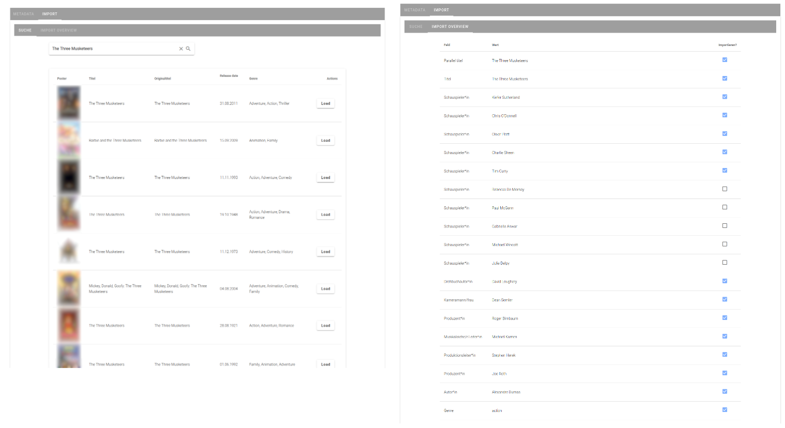
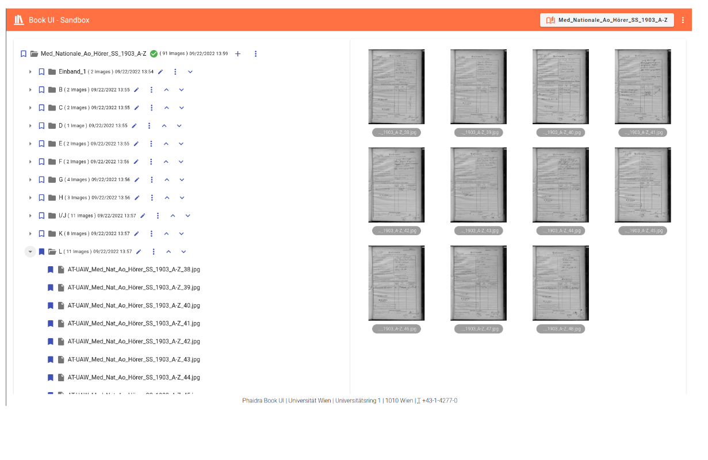

# PHAIDRA architecture
# Table of Contents
1. [PHAIDRA IR](#phaidra-ir)
2. [Media Library](#media-library)
3. [Book Importer](#book-importer)
3. [In development](#in-development)

# Docked applications

Throughout the 15 years of PHAIDRA's history, multiple systems have been integrated with it. There are at least 3 different systems for thesis submit, ingest workflows have been developed from systems like Goobi or Moodle, metadata have been mapped from various repositories, catalogues, etc. Some of the integrations make use of PHAIDRA API and some even PHAIDRA Vue Components. We call the latter "Docker applications". Here are some examples:

## PHAIDRA IR

PHAIDRA IR (as for Institutional Repository) is a PHAIDRA frontend focused on upload of journal articles, working papers, monographs, conference papers and other scholarly materials. The platform supports both secondary and primary publication. It's main feature is curated ingest: an administrator can decide, whether a submit will be accepted into IR or not (in which case it is only accessible via PHAIDRA UI, but not PHAIDRA IR). In case the submit is accepted, the IR admin takes ownership of the object and can edit metadata and access rights. The submit enables import of metadata from a DOI agency and provides a possibility to check publication rights of the journals via Sherpa Romeo services.

Here is how a typical submit form and detail view in PHAIDRA IR look like

</img>

The DOI metadata import feature

</img>

## Media library

The Media Library is focused on ingesting digitized movies (e.g. DVDs). The submit contains metadatafields relevant in this context and also enables an import from The Movie Database (TMDb).

Here is how a typical submit form and detail view in the Media Library look like

</img>

The TMDb metadata import feature

</img>

## Book Importer

The Book Importer was created to enable ingest of digital books. Digital books consist of a series of scans and a PDF file (containing all the images, for easier download). The user needs to create the structure of the book (i.e. organize scans/images into chapters) as well as bibliographic metadata. Upon ingest, the Book Importer creates the digital Book object in PHAIDRA as well as the IIIF-Manifest necessary for the viewer (currently Mirador). The Book Importer was created for robustness: it tries not to overload the repository and can recover from failed ingest in case it runs into network issues or timeouts.

Creating the Book structure:

</img>

Defining bibliographic metadata (using PHAIDRA Vue Components library):

</img>

## In development

### Correspondence UI

A special frontend is being developed which is focused on digitized correspondence (composed of TEI files and scans). It also enables annotations.

</img>

### PHAIDRA OER

The submit of Open Educational Resources will have a dedicated frontend soon.
