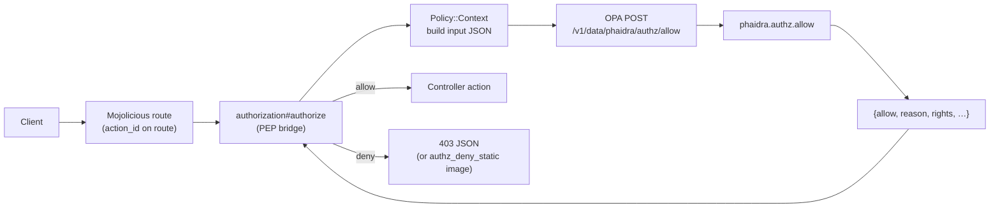
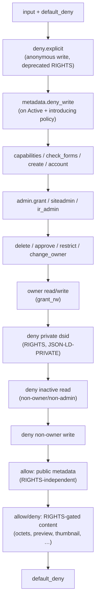

# PHAIDRA OPA Authorization Policies

Rego policies for PHAIDRA authorization decisions, evaluated by [Open Policy Agent (OPA)](https://www.openpolicyagent.org/).

Full API integration details: [`website/docs/authorization.md`](../website/docs/authorization.md).

## Request workflow

Authentication stays in the API; authorization is decided by OPA.



**Bridges** (see `PhaidraAPI.pm`):

| Bridge | Authn | Typical routes |
|--------|-------|----------------|
| `$authz_authnoptional` | Authn optional | Object reads, thumbnails, metadata GET |
| `$authz` | Required | Creates, writes, deletes, account/admin actions |
| `$authenticated` | Required | `/authz/capabilities`, `/authz/check` only |

Each protected route declares an **`action_id`** (`read`, `write`, `create`, `delete`, `approve`, `restrict`, `settings_read`, `admin_*`, …). The bridge passes `pid`, `dsid`, and `endpoint` (`controller#action`) into the OPA input when present.

## OPA input document

Built by `PhaidraAPI::Model::Policy::Context`:

| Field | Source |
|-------|--------|
| `subject` | Username, roles (admin, superuser, default_role, ir_admin), affiliations, LDAP groups, … |
| `resource` | Fedora pid, state, owner, RIGHTS ACL, dsid, flattened metadata (on create/write) |
| `action` | `action_id`, optional `endpoint` |
| `environment` | Timestamp, institution id, remote address |
| `config` | Runtime flags (`enabledelete`, `canmodifyownerid`, admin username) |

Roles like `writer` and `uploader` are **not** hard-coded in the PEP (except elevated roles such as admin/superuser). OPA grants them from `data.phaidra.config.roles` via `helpers.role_granted`.

## Policy evaluation flow

`phaidra/authz/allow.rego` is the single decision document. It imports helper packages and evaluates rules in roughly this order:



**Read path split** (most common source of confusion):

- **Public metadata** (`JSON-LD`, `MODS`, …) — readable on **Active** objects regardless of RIGHTS.
- **Content** (octets, preview, thumbnail, download, …) — gated by the RIGHTS datastream ACL.
- **Private datastreams** (`RIGHTS`, `JSON-LD-PRIVATE`) — owner/admin only.

**Inactive objects** — visible only to owner, admin, superuser (`object.deny_inactive_read`).

## Layout

```
policies/
├── README.md                 ← this file
├── opa-config.yaml           ← OPA server config (decision logs)
├── phaidra/
│   ├── authz/*.rego          ← core policy packages (Git-managed)
│   ├── authz/*_test.rego     ← OPA unit tests (co-located)
│   └── config/data.json      ← default institution bundle → data.phaidra.config
├── univie/config/data.json   ← example institution override
└── data/                     ← bundled copies for OPA mount (generated/synced)
```

### Rego packages

| Package | Role |
|---------|------|
| `phaidra.authz` (`allow.rego`) | Top-level decision; maps to `{allow, effect, reason, rights, …}` |
| `phaidra.authz.helpers` | Shared predicates: `role_granted`, `is_owner`, `is_admin`, … |
| `phaidra.authz.admin` | Site admin username match |
| `phaidra.authz.object` | Owner grant (`grant_rw`), inactive visibility |
| `phaidra.authz.rights` | RIGHTS datastream ACL (username, affiliation, department, …) |
| `phaidra.authz.datastream` | dsid/endpoint classification: private, public metadata, RIGHTS-gated content |
| `phaidra.authz.upload` | Create, delete, approve, change-owner gates |
| `phaidra.authz.metadata` | Curation: `needs_approval`, metadata policy matching, `deny_write` |
| `phaidra.authz.restrict` | Who may POST RIGHTS restrictions |
| `phaidra.authz.account` | Account-scoped actions (settings, groups, lists, …) |
| `phaidra.authz.siteadmin` | Site-admin and IR-admin action lists |
| `phaidra.authz.ui` | Capabilities and submit-form visibility |
| `phaidra.authz.deny` | Fail-fast explicit denies |

## Institution configuration (data bundles)

Tune behaviour in `<institution>/config/data.json` without editing Rego. Loaded as `data.phaidra.config` (select institution via `OPA_INSTITUTION`).

| Config key | Purpose |
|------------|---------|
| `roles` | Who gets `writer`, `uploader`, `approver`, … (`all_authenticated`, usernames, affiliations, ldap_groups) |
| `submit_forms` | Which roles may use privileged upload forms |
| `metadata_policies` | Optional curation rules on create/edit (match JSON-LD fields) |
| `restrictions` | Who may set RIGHTS restrictions, max expiry |
| `delete` | Owner/superuser self-delete roles, `require_enabledelete` gate |

Default `phaidra` bundle: `writer.all_authenticated = true` (legacy parity — any authenticated user may create). Institutions can restrict (see `univie/config/data.json`: staff/faculty + `phaidra-writers` LDAP group).

### Curation quick reference

| `PHAIDRA_DEFAULT_ROLE` | `metadata_policies` | Effect |
|------------------------|---------------------|--------|
| `uploader` (default) | empty | Curation off — uncurated submit |
| `uploader` | configured | Queue when policy newly matches |
| empty / unset | any | Curation on — all creates pending |

`create_initial_state` in `allow.rego` reads `metadata.needs_approval` → `PendingApproval` or `Inactive`.

## Local testing

Run all policy unit tests:

```bash
docker run --rm -v "$PWD/policies:/policies" openpolicyagent/opa:latest test -v /policies
```

Tests live next to the packages they exercise (`allow_test.rego`, `metadata_test.rego`, …).

Evaluate a single decision ad hoc:

```bash
docker run --rm -v "$PWD/policies:/policies" openpolicyagent/opa:latest eval \
  -d /policies -i /path/to/input.json 'data.phaidra.authz.allow'
```

## Decision logs

[`opa-config.yaml`](opa-config.yaml) enables console decision logging. Restart OPA after changes:

```bash
docker compose up -d opa
docker compose logs -f opa
```

Structured audit lines (`authz=1`) are emitted by the API PEP, not OPA — see [`website/docs/authorization.md`](../website/docs/authorization.md#audit).
